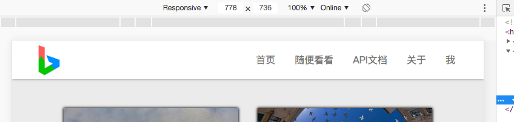
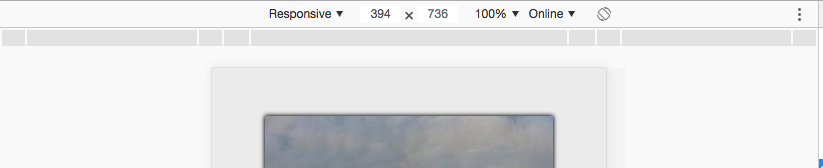

# 【CSS】根据页面宽度显示指定div


### 缘由

在写Bing壁纸的网页的样式的时候想顺手把手机的页面也一并做了，当然做在同一个html页面里面咯，确实不想写2个页面。

第一时间想到的就是Bootstrap、MDL等优秀的前段框架了~他们提供了比较简便且效果很高的解决方案。只不过要引入他们的资源到网页中也要不少的大小，而且只用到这一个功能感觉有点杀鸡用牛刀，大材小用了。（其实可以把相关资源用公共CDN的资源，不仅下载速度快而且还不占用VPS的空间）

于是乎就上网找了找方法，做一个简单的笔记

### 解决方法

首先可以肯定的是能通过JS来实现啦，不过这挺麻烦的。有没有什么办法可以不用编写逻辑代码来实现呢？

带着这个问题继续搜索发现还真的有，只通过CSS就可以实现了，如下代码

```CSS
.header-phone-root-div{
    display: none;
    position: fixed;
    bottom: 0;
    z-index: 9999999;
    background-color: white;
    box-shadow: gray 0 0 6px;
    flex-direction: row;
    align-items: center;
    justify-content: space-around;
    width: 100%;
    padding-bottom: 0;
}

@media (max-width: 767px) {
    .header-phone-root-div{
        display:flex;
        position: fixed;
        bottom: 0;
        z-index: 9999999;
        background-color: white;
        box-shadow: gray 0 0 6px;
        flex-direction: row;
        align-items: center;
        justify-content: space-around;
        width: 100%;
        padding-bottom: 3px;
    }

}
```

如上图的CSS

当`header-phone-root-div`的宽度小于767px时，将会套用下面的CSS，否则就套用上面的CSS，效果如下图

当宽度大于767px时



当宽度小于767px时



效果还可以~