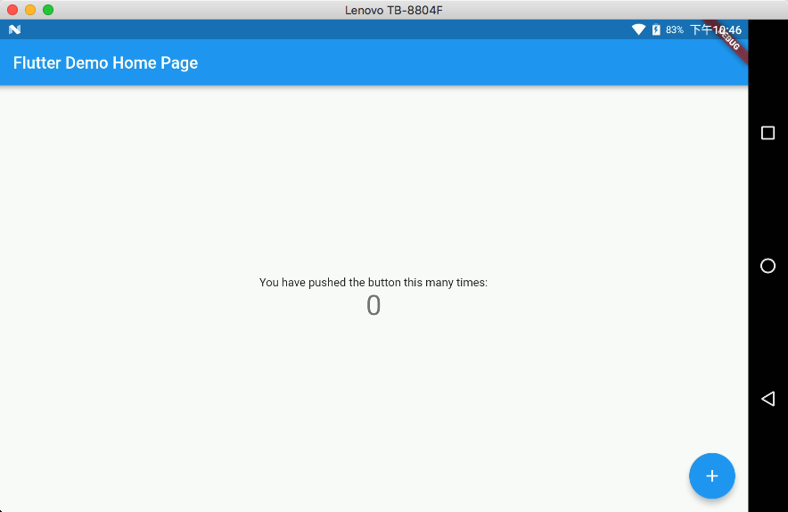

#【Flutter从0开发一个跨平台文字冒险游戏 】#1 - 起步

## 背景

某天在准备去午睡的时候，突然一时兴起想到一个故事背景，想写个游戏把故事描述出来。为了想用相对少的代码来写写这个玩具游戏，想实现这个基于文字+简单图片和按钮的游戏当然选择有挺多的，第一想到的是React Native或者直接使用Html5来编写。正准备建立工程的时候看到一位网友提到了Flutter，如果用这个来实现的话，还能顺手入门一个新的UI框架，遂打算使用Flutter来进行游戏的编写(虽然说我也不懂RN，但是感觉起来Flutter更有吸引力)。

## 什么是Flutter

Flutter是谷歌的移动UI框架，可以快速在iOS和Android上构建高质量的原生用户界面。 Flutter可以与现有的代码一起工作。在全世界，Flutter正在被越来越多的开发者和组织使用，并且Flutter是完全免费、开源的。

它也是构建未来的Google Fuchsia 应用的主要方式。

# 环境配置

环境配置也是很让人头疼的一环，记得在之前我也有尝试过去安装尝试Flutter的，结果第一次是卡在了环境配置上，很头疼🤦‍♀️

安装环境时可以参考 [Flutter中文网](https://flutterchina.club/)上的教学来进行配置，下面这里说下我自己的配置方法，我自己使用的是MacOS，其他的也大同小异

1. **下载FlutterSDK**

   访问[Flutter官网](https://flutter.io/)下载Flutter的SDK到本地，我把文件下载到了`~/software/`这个路径

2. **解压文件**

   解压下载到的SDK到你喜欢的目录，参考命令

   ```bash
   cd ~/software/
   unzip ./flutter_macos_v0.11.12-beta.zip
   ```

3. **添加Flutter到PATH中**

   参考命令

   ```bash
   export PATH=$PATH:`pwd`/flutter/bin
   ```

   到这里你就可已在当前的终端中使用`flutter`命令啦，不过这个时候还是临时的命令，会在你重启后失效，想要永久添加的话，可以参考这个[链接](https://unix.stackexchange.com/questions/26047/how-to-correctly-add-a-path-to-path)

   如果你使用IDEA或者Android Studio进行开发的话，其实不添加问题也不大

4. **继续排错**

   执行诊断命令，如下所示

   ```bash
   flutter doctor
   ```

   看看剩下的提示，按照提示进行修复即可，遇到问题可以直接Google，一般都会有解决办法。

   对于Android Studio和IDEA的话，需要安装flutter这个插件，VSCode也是，在插件里面搜索安装即可

   突然想起，之前在一台低内存（2GB）的机器安装的时候遇到了内存不足的问题，其实可以通过修改配置来进行解决的，虽然不需要升级硬件也能解决。不过开发的时候也是卡的不行，所以还是建议换吧

## Hello World

1. **打开Android Studio**

   在安装了Flutter插件以后，Android Studio会多出一个 `Start a new Flutter project`

2. **选择 Flutter Application，Next**

3. **配置工程名称，设置Flutter SDK，Next**

4. **配置包名，Finish**

5. **运行程序**

   这时候应该能看到Demo程序跑起来啦

   

## 参考

 [CreeperSan/the_monster_has_been_sealed](https://github.com/CreeperSan/the_monster_has_been_sealed)

[Flutter(软件) - 维基百科，自由的百科全书](https://zh.wikipedia.org/wiki/Flutter_(%E8%BD%AF%E4%BB%B6))

[Flutter （移动应用程序开发框架）_百度百科](https://baike.baidu.com/item/Flutter/22498985)