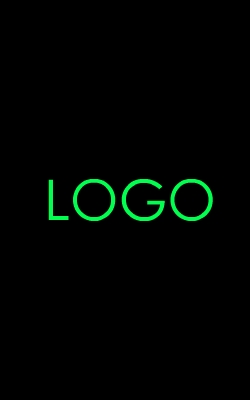
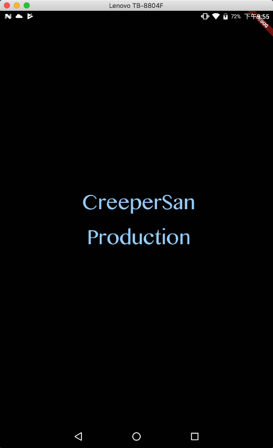

# 【Flutter从0开发一个跨平台文字冒险游戏 】#2– 简简单单的启动界面

## 前言

经过前面的折腾，我们的Flutter总算是运行起来啦，其实这段时间，Flutter也推出了 1.0 正式版，这里插一句话，如果要升级的话可以执行下面的命令来对Flutter进行升级

```
flutter upgrade
```

执行了这个命令后，稍等一段时间（我是等了好长一段时间）就升级好了，来试一试吧

## 开篇

由于我打算做的是一个简单的基于文字和少量图片的RPG游戏，游戏中不需要大量的渲染也不需要大量的主动刷新，大部分都是基于玩家的操作然后给予反馈。因此，为了省电就不使用其他的游戏引擎了，就直接使用Flutter自带的组件库来完成。

## 关于Dart

Flutter采用了Dart作为其编程语言，Dart是由Google主导开发的，目标成为下一代结构化Web的开发语言。如果想了解更多有关于Dart语言的其他东西，可以参考 [起步 | Dart](http://dart.goodev.org/guides/get-started) 官方网站，在这里我就不详述啦（因为我也不懂🤣，我还是边写游戏边感悟吧，感觉dart和Java有点像）

## 最简单的Hello World

回到我们上面的工程，工程里面已经默认有一个小的应用程序了，尽管它只是一个简单的计数器，但是里面也包含了不少的代码，为了快速了解了解其本事，我们还是看看一个最简单的Flutter应用程序的代码是怎么样的吧。如下

```dart
import 'package:flutter/material.dart'

void main(){
    runApp(
    	new Center(
        	child: new Text("Hello World"!),
            textDirection: TextDirection.ltr,
        )
    );
}
```

就像上面代码描述的，这个就是一个最简单的 Hello World啦，让我们开始下手吧

首先，我们先从Flutter程序的入口`void main()`开始看起

main函数里面很简单，里面就执行了一个语句`runApp`，顾名思义，这个函数就是把App给运行起来，并给它传递了一个参数 Center 类的实例。而这个Center其实就是一个Widget，这个Widget是一个容器，在他的child下面的Widget将会居中显示。而在他们的里面child下面有一个Widget —— Text，这个Widget的作用就是显示文本在屏幕上，同时我们看到这里也同时定义了 textDirection 为 TextDirection.ltr 其作用就是让文本的显示方向为从左到右显示（默认也是这样，可以省略）。综上，其实上面的程序将会在屏幕的中央显示 Hello World! 的文字。

## 关于游戏启动界面

嘛，关于游戏的启动画面，也不多想了，就一个黑色屏幕加上一个居中的Logo图片就完事把，大概长下面这个样子



看起来挺简单的是不是？如果是Android上写xml布局的话，相信大家都会写吧，基本上就是一个FrameLayout里面套一个ImageView就完事了~伪代码看起来就像下面这个样子

```xml
<FrameLayout
             android:layout_width="match_parent"
             android:layout_height="match_parent">
    
    <ImageView
               android:src="@drawable/01.jpg"
               android:layout_gravity="center"
               android:layout_width="wrap_content"
               android:layout_height="wrap_content"/>
    
</FrameLayout>
```

那么，要是这个是要在Flutter下面呢？其实也是类似这个样子也是一个CenterWidget套一个ImageWiget，代码看起来像下面这个样子

```dart
new Center(
	child:new Image(
		image:new AssertImage("assets/graphics/logo/logo_production.png")
	)
);
```

我么把它套入到前面HelloWorld程序中，看起来就是这样子的

```dart
import 'package:flutter/material.dart'

void main(){
    runApp(
    	new Center(
			child:new Image(
				image:new AssertImage("assets/graphics/logo/logo_production.png")
			)
		)
    );
}
```

在程序运行起来之前，我们得先把图片添加到工程中。

首先，我们在工程的根目录下添加图片，在我上面的代码中是把它放在了

`./assets/graphics/logo/logo_production.png`

下面，文件夹是不存在的，需要自己创建。放在工程下其他地方也是OK的，只要能找到就没问题。

接下来就是添加对应的资源到`pubspec.yaml`中，打开此文件，在`flutter:`下面添加

```
assets:
  - assets/graphics/logo/logo_production.png
```

应该就可以了，编译运行看看效果



大概就是这样啦，其布局也很简单。相信各位看一下上面代码也能秒懂了。其实就是以一个`Center`作为布局，这个布局的作用是将其下的Widget在布局中居中显示。那么需要显示的Widget，就是`Center`下面的`Image`这个Widget，这个Widget的作用顾名思义，就是显示一张图片。那么要显示的图片从哪里来呢？在本例中，要显示的图片是从资源中加载进来，所以`Image`里面的`image`字段就是`AssertImage`的实例。当然你也可以从文件，或者是从网络中加载图片，使用对应的方法就好。

## 代码组织

仔细看了看，界面是跑了起来，但是现在所有东西都写在了Main函数里面，小的程序还勉强说得过去，但是程序写多了以后肯定看着都痛苦。所以我们也得把这些代码给分开。**参照Android里面的样子**，我们可以把游戏的界面分在一些单独的class里面，分开后看起来就像这个样子

```dart
import 'package:flutter/material.dart'

void main() => runApp(new BootActivity());

class BootActivity extends StatelessWidget{
    @override
    Widget build(BuildContext context){
        return new Center(
        	child:new Image(
				image:new AssertImage("assets/graphics/logo/logo_production.png")
			)
        );
    }
}
```

嗯，看起来熟悉多了，虽然说不建议把这些完全当成是Android来写代码，但是拿来上手上手看还是很舒服。

简单的启动界面显示LOGO就先到这里吧，我们未完待续！