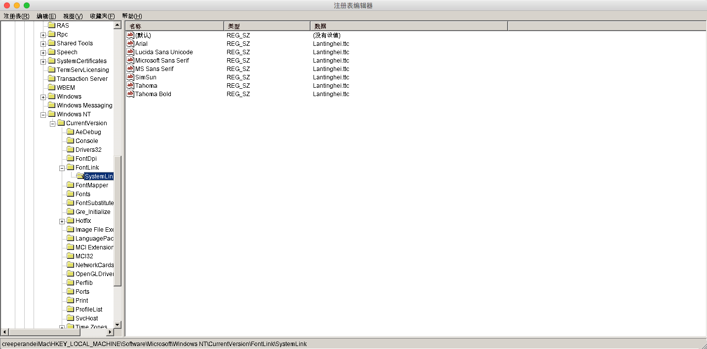
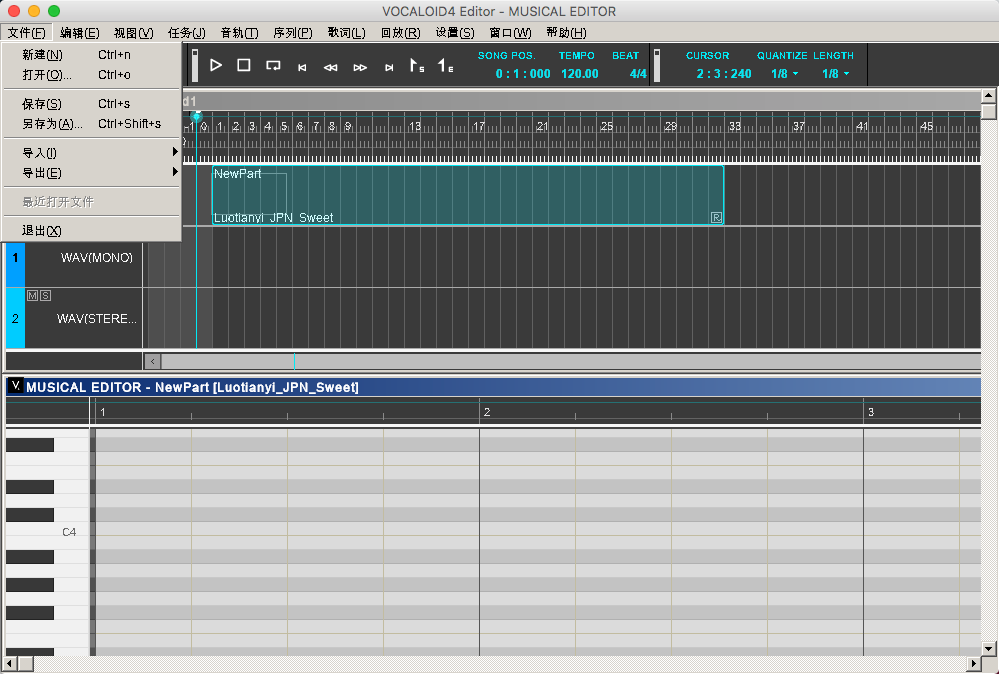

# 【Wine】解决Wine在Mac OS X下中文显示为方框的问题

## 前言

自从从 Windows 切换到 Ubuntu 再到现在的黑苹果，最终发现Mac OS X才是用着真的舒服，没有了Windows下扰人的广告，难搞的环境，缺失的包管理软件（虽然说有第三方的），同时也不用忍受Ubuntu下常用软件的缺失和Bug（Ubuntu18.04下网易云音乐打开不显示应用界面..折腾了一会发现打开软件后，再点击关机按钮，界面才出来..奇怪），这些问题下Mac OS X用着是真的让人感到舒服。

当然Mac OS X也有很多地方表现不如人意，比如说游戏的缺失，图形渲染能力相比Windows下要逊色不少（我用的黑苹果。。），鼠标右键菜单没有新建文件等等。

为了弥补其中一些Windows下的独占软件问题，网上有一个神器可以在Mac OS X下模拟Windows的运行环境，可不是虚拟机哦。[Wine](https://www.winehq.org/)，同时也支持Linux平台，安装方法就不说明了，按照官网一步一步来就好了，按照提示就能安装完成。

## 问题

但是在通过Wine运行Windows下的中文程序的时候原本该显示中文的地方却显示成了乱码，究其原因是因为找不到中文字体，嘛其实也不是真的缺少中文字体，只不过在寻找中文字体的时候注册表没有相关信息，所以都指向了默认的字体，而默认字体不包含中文字体，于是在需要显示中文的地方就变成了一个一个的方框

## 解决

了解了问题后就好解决了，只要在注册表上增加对应的信息即可，经过Google搜索和尝试，终于可以让中文正常显示了，在这里记录下解决方法，解决方法是参考自 [月迷津渡丶 - wine mac 中文 方块乱码 解决](https://blog.csdn.net/oYueMiJinDu/article/details/79686749) 的这篇文章。本文章在他的基础上做了一些内容上的修改，但大体是一样的

1. **新建注册表文件**

   在你的文本编辑器里新建一个文件，输入以下内容

   ```
   Windows Registry Editor Version 5.00
   
   [HKEY_LOCAL_MACHINE\Software\Microsoft\Windows NT\CurrentVersion\FontLink\SystemLink]
   
   "Arial"="Lantinghei.ttc"
   
   "Lucida Sans Unicode"="Lantinghei.ttc"
   
   "Microsoft Sans Serif"="Lantinghei.ttc"
   
   "MS Sans Serif"="Lantinghei.ttc"
   
   "SimSun"="Lantinghei.ttc"
   
   "Tahoma"="Lantinghei.ttc"
   
   "Tahoma Bold"="Lantinghei.ttc"
   ```

   然后保存文件为`font.reg`到你喜欢的地方。（其实文件名可以随意）

2. **打开注册表编辑工具**

   打开 Wine 的终端

   

   输入`wine regedit` 打开Windows下的注册表编辑工具

   找到`[HKEY_LOCAL_MACHINE\Software\Microsoft\Windows NT\CurrentVersion\FontLink\SystemLink]`这个位置

3. **导入设置**

   点击左上角菜单栏的  注册表 → 导入注册表文件

   找到刚刚我们保存的`font.reg`导入即可

4. **大功告成**

   导入完成应该就是这个样子
   

   我们打开个程序试试

   哈哈，可以显示中文啦

   

## 参考链接

[月迷津渡丶 - wine mac 中文 方块乱码 解决](https://blog.csdn.net/oYueMiJinDu/article/details/79686749)