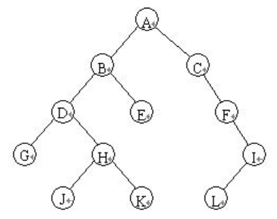
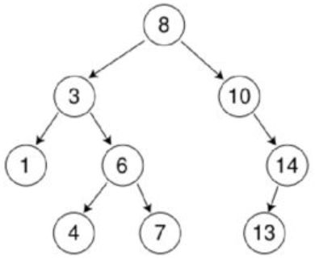

# 【数据结构】关于二叉查找树的浅析

## 树是什么

树，这个数据结构在计算机科学中可是非常普遍的，树是一种抽象数据类型（ADT）或是实现这种抽象数据类型的数据结构，用来模拟具有树状结构性质的数据集合，它是由n(n>0)个有限节点组成一个具有层次关系的集合。举个例子，我们PC上接触到文件系统就是树这个数据结构的完美体现。



如上图所示，就是一棵简单的树。我们之所以它称之为树，主要原因还是他看起来就像一颗倒挂的树。

## 树具有什么特点

> 摘自[维基百科](https://zh.wikipedia.org/wiki/%E6%A0%91_(%E6%95%B0%E6%8D%AE%E7%BB%93%E6%9E%84))

+ 每个节点有0个或者多个子节点
+ 没有父节点的节点成为根节点
+ 每一个非跟节点都有一个子节点
+ 除了根节点外，每个子节点可以分为多个不相交的子树

~~当子节点之间相交形成一个环的时候的数据类型应该是图了吧，我还没看到图这个数据类型相关的知识，这个是我猜测的🤮~~

## 什么是二叉查找树

二叉查找树(BST , Binary Search Tree)，也叫二叉排序树。显然，从名字可知这个数据类型属于树的子集，它具有和树一样的特征。并且在此之上，它的还具有以下的一些特点

+ 每个节点下最多只有2个节点
+ 每个节点下，其左节点的值总是要小于自身的值，其右节点的值总是要大于自身的值。也就是说，把这棵树拍扁成一个线性表，其数值总是递增的。

就像下面的这个例子



上面这棵树中就是一个二叉查找树，因为他的每一个节点下最多只会有2个子节点，而每个子节点都满足左节点的值比本身的值小，右节点的值比本身的值大。我们把这棵树的值按左到右的顺序排好，以此为`1、3、4、6、7、8、10、13、14`，可以看出，是完全符合规则的。

## 简单编程

这里我们采用Kotlin语言来实现这个二叉查找树。

首先每一棵树都是由一个一个的节点之间相互连接起来组成的，其重点就是节点自身和节点与节点之间的连接。于是我们可以得到以下的一个节点类

```kotlin
class Node(var value: Int, var left: Node?, var right: Node?)
```

为了简化说明，我这里就直接定义节点的值类型为`Int`了，你可以使用其他您需要的类型。Also，你也可以在节点中指定父节点的值，这样你就可以从任意一个节点追溯到他的父节点中。这里我也是为了简化说明，所以就不实现了。

节点做好了，那么剩下的就是装填这些节点的容器——树，的实现了。我们可以如下实现

```kotlin
class BinarySearchTree(var root:Node)
```

这样就是一颗简单的树啦，你可能会问了，为什么这棵树就只有一个节点呢？其实没有错的，因为一棵树中的每一个节点之间都和附近的节点存在一层一层的联系，我们通过父节点，就可以从他们的子节点遍历下去，进而遍历到这棵树中的每一个节点。

## 插入节点

作为一个容器，我们肯定需要往里面插入数据，这个是最基本的要求了。

考虑到树的每个节点的排列位置和数量都是有着一定要求的，每个节点下最多2个节点，而且左节点比自身大，右节点比自身小。那么综上，我们可以这样编写增加节点的函数

```kotlin
	// class BinarySearchTree

    fun put(node:Int){
        if (node == value){
            value = node
        }else if (node > value){
            right?.put(node) ?: Node(node, null, null)
        }else{
            left?.put(node) ?: Node(node, null, null)
        }
    }
```

思路是这样的：

①判断节点的值和自身是否相等，如果相等，则替换掉自身的值。

②判断节点的值是否大于自身的值，是并且右边没有节点，则放入到右边节点的位置，是并且右边存在节点，则对右节点递归判断。当然，为了性能和安全考虑，还是建议尽量使用尾递归去处理，毕竟调用一个函数存在压栈操作，处理起来需要时间而且更占用内存，极端的情况下，遇到一个数据量很大并且不平衡的树有可能会爆栈。

③判断节点的值是否小于自身的值，是并且左边没有节点，则放入到左边节点的位置，是并且左边存在节点，则对左节点递归判断。

## 删除节点

有增加自然有删除，至于删除我们可以这样实现

```

```

