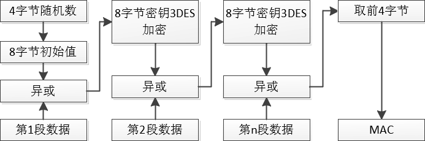
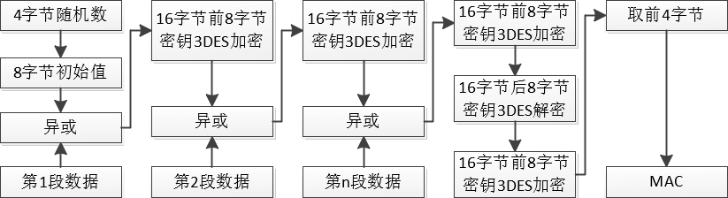
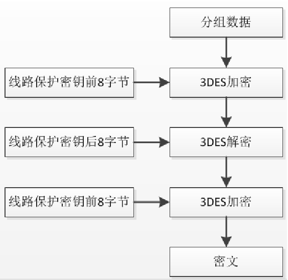

# 【智能卡】關於智能卡的綫路保護一些計算方法

## 前言

近段時間因爲需要，需要操作關於智能卡的一些内容。其中涉及到一些綫路保護加密計算的時候花了一些時間找了找相關資料。這裏做一個簡單的記錄

## MAC

### 用途

MAC为安全报文校验码，可以用于在一些线路保护的情况下使用。比如在创建二进制文件的时候设置了相应标志位，那么在执行对应读写操作的时候就计算Mac插入到发送的消息中等等

### 計算流程

大致操作步骤如下

1. 选择到需要操作的目录

2. 发送获取4字节随机数指令

3. 拿到4字节的随机数指令后在后面补全上4字节的0x00作为初始值

4. 把命令报文（Lc需要算上4字节Mac的长度）按照8个字节一段把数据分段

5. 数据分段后最后一段如果结尾刚好为8个字节，则在数据的后面添加0x8000000000000000这一段8字节数据；如果最后一段长度不为8，则在这段数据后面增加0x80，要是最后一段数据依然不为8个字节，那么则继续增加0x00数据直到最后一段数据长度为8个字节为止

6. 如果维护密钥长度为8字节，首先先让初始值和第1段数据进行异或，把异或得到的数据维护密钥作为key进行3DES加密，得出加密后的结果再与第2段数据进行异或，再把异或得到结果使用维护密钥进行3DES加密，以此类推，直到得出最后一段3DES加密后的数据。截取这段8字节的数据的前4个字节，即为Mac。

   

7. 如果维护密钥长度为16字节，首先先让初始值和第1段数据进行异或，把异或得到的数据使用16字节的维护密钥前8字节作为key进行3DES加密，得出加密后的结果再与第2段数据进行异或，再把异或得到结果使用16字节维护密钥的前8字节进行3DES加密，以此类推，直到得出最后一段3DES加密后的数据，然后把这段数据和16字节密钥的后8字节进行3DES解密，最后把得到的数据与16字节密钥的钱8字节加密,得到8字节的数据。截取这段8字节的数据的前4个字节，即为Mac。其操作流程图如下

   

### 示例

比方说现在我已经通过00A4命令选择文件为001F文件了，其文件大小为0x10字节，这个文件在创建时配置的读权限为线路保护，需要明文+MAC读取，我想要读取其所有内容，可以如下操作

1. **复位并选择到此文件**

   过程略，這裏就不詳述啦

2. **获取随机数**

   发送获取4字节随机数
   发送  ->  0084000004
   返回  <-  46B6BD78【9000】

3. **计算初始值**

   因此其随机数为46B6BD78，补充为8字节初始值46B6BD7800000000

4. **计算数据块**

   数据块是由CLA+INS+P1+P2+Lc的顺序组成，其中Lc所表示的长度需要包括上Mac的长度，所以其数据块为04B0000004，进行补全后为04B0000004800000，经过分段后为["04B0000004800000"]

5. **计算MAC**

   把初始值和第1段数据进行异或，结果为4206BD7804800000，
   然后再把这个数据与维护密钥前8字节进行3DES加密，得到6D167ABEFAC0FE49。
   由于只有一段数据，因此接下来这段数据与16字节密钥后8字节进行3DES解密，得到4206BD7804800000，
   最后把得到的数据再与密钥前8字节加密，得到的数据为6D167ABEFAC0FE49，
   取其前4字节为6D167ABE，所以Mac为6D167ABE。（当前目录下维护密钥为00000000000000000000000000000000，16字节的0x00）

6. **合成命令**

   因此需要最终发送的指令为04B00000046D167ABE，后4字节为Mac，Lc为0x04（包括上Mac的长度）

7. **发送指令**

   发送  ->  04B00000046D167ABE
   返回  ->  00000000000000000000000000000000【9000】

## 綫路加密

### 用途

在创建文件的时候，出于安全的原因考虑，我们可以在创建的时候使用线路加密保护的方式创建一个文件。当我们想要操作这个文件的时候，需要把数据进行加密，然后再结合上面7.1提到的Mac组成一条指令发送过去。这样大大提高了传输过程中的安全性。

### 用途

大致操作步骤如下

1. 选择到所需要操作的目录或者文件

2. 提取要发送指令的Data字段

3. 在Data字段的前面加上一个字节的Data长度

4. 然后检查组合而成的数据长度是否为8字节的整数倍。如果不是，则在后面增加1字节的0x80，再次检查。如果仍然不是8字节的整数倍，那么就在后面增加1字节的0x00直到长度为8字节的整数倍为止。如果是8字节的整数倍，则进行下一步操作

5. 将补全完成后的数据按照8字节为一组按顺序分组

6. 将分组的每一段数据按照下图进行加密运算

   

7. 把每一组加密后的分组数据按照原顺序拼接起来，所得到的数据即为加密后的密文数据

### 示例

举个例子，比如说我需要对二进制文件001F进行写入操作（线路保护加密，读写权限BB），那么可以这样操作

1. **复位并选择到此文件**

   过程略

2. **进行Pin验证**

   过程略。由于这个文件的读写权限为BB，而Pin验证后的权限标志位为0xB
   所以需要先进行Pin验证。这个操作是否需要具体要看当前权限是否满足创建文件时设定的读写权限要求。

3. **补全数据**

   需要更新次二进制文件的前8字节为0xA0FE717AF534D2C3。所以我们先在数据的前面补上1字节的数据长度0x08。得到的数据为0x08A0FE717AF534D2C3
   接下来，由于补上数据长度的后Data字段的长度为9字节，不是8的整数倍，所以需要对其进行补全。补全后的结果为0x08A0FE717AF534D2C380000000000000

4. **对数据进行分段**

   按8字节数据为一段，对数据进行分段操作。分段后的结果为["08A0FE717AF534D2", "C380000000000000"]

5. **对分段后的每段数据进行加密**

   对分段后的每一段数据进行加密，得到的加密后的结果为["40821C3118460C80", "9FE9EF9D28910F94"]，连接每一段数据，得到的密文为0x40821C3118460C809FE9EF9D28910F94

6. **加密完毕，组合指令计算Mac**

   至此，密文已经加密完毕，将其放回指令的Data字段中计算Mac。过程参照7.1。详细步骤略，最后得到的Mac为0x3ED14300

7. **发送指令**

   发送指令把密文和Mac填入到指令中，发送指令
   发送 -> 04D600001440821C3118460C809FE9EF9D28910F943ED14300
   接受 <- 【9000】
   至此，二进制数据更新完成

## 結語

以上就是前段時間的關於綫路保護加密的一些總結，如有不正確的地方，還請大家吐槽哈