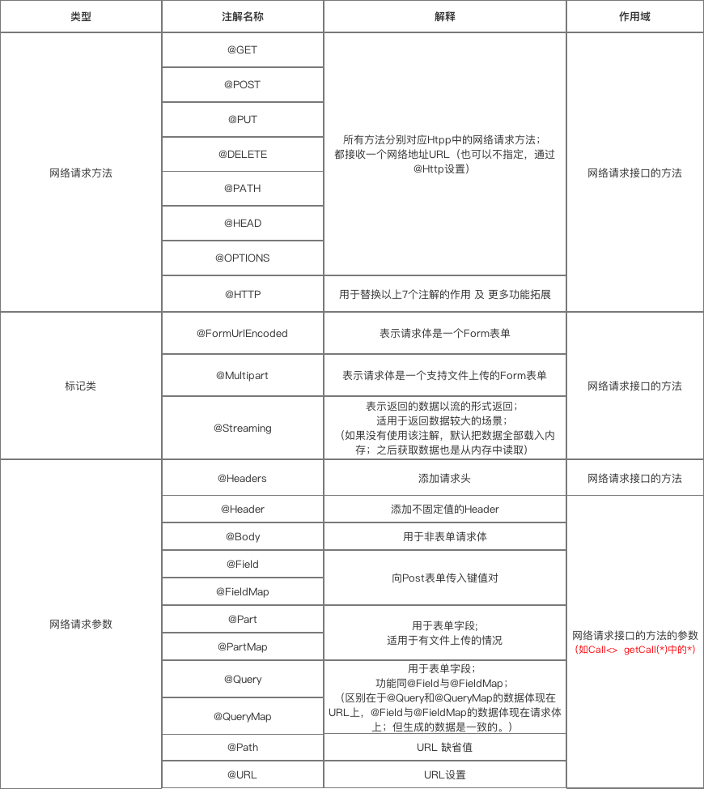

# 【Android】Retrofit2使用入门

## 介绍

Retrofit是Square公司基于OkHttp开发的一款针对Android的网络请求框架。于其他网络框架不同的是，它更多使用注解的方式提供功能。准确来说，Retrofit 是一个 RESTful 的 HTTP 网络请求框架的封装。网络请求的工作本质上是 OkHttp 完成，而 Retrofit 仅负责 网络请求接口的封装


## 快速入门

使用retrofit2大致有以下步骤，分别是

1. ### 集成

截止北京时间2019/02/12，最新版本为v2.5.0，官方共提供3种方法用于集成到项目中，下面这些还包含了Gson解析器，这个就看个人洗好咯

+ 第一种是通过Jar包的方法集成，下载地址 [Retrofit2  v2.5.0](https://repo1.maven.org/maven2/com/squareup/retrofit2/retrofit/2.5.0/retrofit-2.5.0.jar)  [Retrofit-Gson  v2.5.0]([the latest JAR](https://search.maven.org/remote_content?g=com.squareup.retrofit2&a=converter-gson&v=2.5.0))

+ 第二种是通过Maven的方式集成

   ```xml
   <dependency>
     <groupId>com.squareup.retrofit2</groupId>
     <artifactId>retrofit</artifactId>
     <version>2.5.0</version>
   </dependency>
   <dependency>
     <groupId>com.squareup.retrofit2</groupId>
     <artifactId>converter-gson</artifactId>
     <version>2.5.0</version>
   </dependency>
   ```

   

+ 第三种是通过Gradle的方式集成

   ```
   implementation 'com.squareup.retrofit2:retrofit:2.5.0'
   implementation 'com.squareup.retrofit2:converter-gson:2.5.0'
   ```


2. ### 创建相关的请求类

   接下来我们就可以创建向服务器发送请求的相关代码。这里先打个比方，假如我现在需要Get请求`http://bing.creepersan.com/api/v1/url`来获取相应的日本必应历史图片信息。我们可以这样写

   ```kotlin
   interface BingUrlRequest{
   	
       // @FormUrlEncoding
       @GET("api/v1/url")
       fun getBingUrl(@Query("count") count:Int=12):Call<BingUrlResponse>
   
   }
   ```

   其中我们可以看到这上面有三个注解（虽然有一个是注释的），他也对应着`Retrofit2`的三大注解分类，其总表如下

   


+ 请求方法注解

  请求方法注解，在上面就是对应`@GET("/api/v1/url")`这个注解了。顾名思义，这个注解也就决定了发送的请求方法。其总共有8类，分别是`@GET`、`@POST`、 `@PUT`、`@DELETE`、`@HEAD`、`@PATCH`、`@OPTIONS`和`@HTTP`。由于上面的接口是`GET`请求的，所以我这里就使用了`@GET`，其后面的参数为请求的URL。

  这这里面比较特别的是`@HTTP`，他可以用于替换剩余7种的注解，还可以进行更多功能的拓展。具体属性则是通过指定其`method`、`path`、`hasBody`进行设置、比如像这样子

  ```kotlin
  @HTTP(method = "GET", path = "api/v1/url", hasBody = true)
  ```

  还有就是，我们可以发现，`Retrofit2`把URL分成了2部分，注解传的参数只有URL的路径名。那么剩余的服务器域名或者是服务区地址呢？别急，我们在下面就能看到了。

  

+ 标记类注解

  标记类注解，可以看到上面已经注释了的`@FormUrlEncoding`

  同样的，标记类注解也有三种，分别是`@FormUrlEncoding`、`@Multipart`和`@Streaming`这三种。

  + `FormUrlEncoding` 表明请求体是一个Form表单，表示发送form-encoded的数据。每个键值对需要用`@Field`来注解键名，随后的对象需要提供值。由于我们上面的GET请求并没有表单，所以我把它注释掉了。要不然会报错的。使用起来，比如说像这样子

  ```kotlin
      @FormUrlEncoded
      @POST("test")
      fun getTest(@Field("key") key:String)
  ```

  + `@Multipart` 表明请求体是一个支持文件上传的Form表单。每个键值对需要用`@Part`来注解键名，随后在对象中需要提供值。例子如下

  ```kotlin
      @Multipart
      @POST("test")
      fun upload(@Part file:MultipartBody.Part, @Part("description") description:RequestBody)
  ```

  ​	那么，请求网络时代码如下

  ```kotlin
          val file = File("你的路径")
          val requestBody = RequestBody.create(MediaType.parse("image/png"), file)
          val photo = MultipartBody.Part.createFormData("photos", "1.png", requestBody) // 对应 MultipartBody.Part，指上传的图片文件
          val des = RequestBody.create(null, "描述") // 对应 RequestBody，指简单的键值对
  ```

  + `@Streaming` 表示返回的数据将会以流的方式返回，（默认会把内容全部加载到内存中）。适合大文件的下载。相关代码如下面所示。

   ```kotlin
  @Streaming
  @GET("test")
  fun upload():Call<BingUrlResponse>
   ```

  ​	需要注意的是，在这种情况下我们就不能继续使用上面的方法来解释了。否则会报`NetworkOnMainThreadException`的异常，原因大家都懂得。因此我们需要把最后的接受数据操作放在一个单独的工作线程中。

  

+ 参数类注解

   参数类注解有`Header`、`Headers`、`Body`、`Path`、`Field`、`FiledMap`、`Part`、`PartMap`、`Query`、`QueryMap`等等。

  + `@Header`  `@Headers` 添加请求头 添加不固定的请求头

    ```kotlin
    // @Header
    @GET("user")
    fun getUser(@Header("Authorization") authorization:String):Call<User>
    
    // @Headers
    @Headers("Authorization: authorization")
    @GET("user")
    fun getUser():Call<User>
    ```

    以上的效果是一致的，区别在于使用场景和使用方式。@Header用于添加不固定的请求头，@Headers用于添加固定的请求头。@Header作用于方法的参数；@Headers作用于方法

  + `@Field` `@FieldMap` 传输数据类型为键值对

    发送 Post请求 时提交请求的表单字段，表明是一个表单格式的请求（Content-Type:application/x-www-form-urlencoded）。请求代码如下所示

    ```kotlin
    @FormUrlEncoded
    @Post("test")
    fun getTest(@Field("ip") fitst:String)
    ```

    如果是FiledMap则如下

    ```kotlin
    @FormUrlEncoded
    @Post("test")
    fun getTest(@FieldMap fitst:Map<String,Any>)
    ```

    

  + `@Body`  传输数据类型JSON字符串

    我们也可以用POST方式将JSON字符串作为请求发送到服务器，请求网络接口的代码如下面所示

    ```kotlin
    @POST("test")
    fun getTest(@Body ip:IP)
    ```

    其中IP的定义如下

    ```kotlin
    class IP{
    	var ip:String = ""
    }
    ```

    通过此方法发送的请求数据为一个Json字符串。需要注意的是，如果提交的是一个Map，那么作用相当于 `@Field` 

  + `@Part`  `@PartMap` 单个、多个文件上传

    代码可参考`@MultiPart`部分

  + `@Path` 动态配置Url地址

    那么在发送请求的时候，将会把传入的字符串，填写到`{path}`中去，大大提高了灵活性，例子如下

    ```kotlin
    @GET("{path}/test.php")
    fun getTest(@Path("path") path:String):Call<Test>
    ```

  + `@Url`   直接传入一个请求的 URL变量 用于URL设置

    当有URL注解时，@GET传入的URL就可以省略。当GET、POST...HTTP等方法中没有设置Url时，则必须使用 {@link Url}提供。例子如下

    ```
    @GET
    fun testUrlAndQuery(@Url url:String):Call<ResponseBody>
    ```

  

3. ### 创建相关服务器返回信息类

   然后是创建服务器返回的相关信息类。还是请求上面的Api接口，如果请求正常的话，他的回复应该是这样的。

   

   那么我们可以根据这个Json写出下面的服务器返回数据格式

   ```kotlin
   class BingUrlImageItemBean{
       var date:Int = 20000000
       var year:Int = 0
       var month:Int = 0
       var day:Int = 0
       var title:String = ""
       var location:String = ""
       var author:String = ""
       var img_url:String = ""
       var img_url_thumbnail:String = ""
       var img_url_base:String = ""
   }
   
   class BingUrlDataBean{
       var itemCount:Int = 0
       var imgList: ArrayList<BingUrlImageItemBean>? = null
   }
   
   class BingUrlResponse{
       var flag:Int = 0
       var data : BingUrlDataBean? = null
   }
   ```

   需要注意的是，所创建的变量名必须要和Json返回的键名相对应，而且层级关系也要和Json保持一致。

4. ### 创建Retrofit实例

   相关代码如下

   ```kotlin
           val retrofit = Retrofit.Builder()
                   .baseUrl("http://bing.creepersan.com")
                   .addConverterFactory(GsonConverterFactory.create()) // 设置数据解析器
                   //.addCallAdapterFactory(RxJavaCallAdapterFactory.create()) // 支持RxJava平台
                   .build()
   ```

   + 关于数据解析器（Converter）

     Retrofit支持多种数据解析方式，使用时需要在Gradle添加依赖

     | 数据解析器 | Gradle依赖                                      |
     | ---------- | ----------------------------------------------- |
     | Gson       | com.squareup.retrofit2:converter-gson:版本      |
     | Jackson    | com.squareup.retrofit2:converter-jackson:版本   |
     | Simple XML | com.squareup.retrofit2:converter-simplexml:版本 |
     | Protobuf   | com.squareup.retrofit2:converter-protobuf:版本  |
     | Moshi      | com.squareup.retrofit2:converter-moshi:版本     |
     | Wire       | com.squareup.retrofit2:converter-wire:版本      |
     | Scalars    | com.squareup.retrofit2:converter-scalars:版本   |

   + 关于网络请求适配器（CallAdapter）

     Retrofit支持多种网络请求适配器方式：guava、Java8和rxjava 。使用时如使用的是 `Android` 默认的 `CallAdapter`，则不需要添加网络请求适配器的依赖，否则则需要按照需求进行添加 
     Retrofit 提供的 `CallAdapter`

     | 网络请求适配器 | Gradle依赖                                 |
     | -------------- | ------------------------------------------ |
     | guava          | com.squareup.retrofit2:adapter-guava:版本  |
     | Java8          | com.squareup.retrofit2:adapter-java8:版本  |
     | rxjava         | com.squareup.retrofit2:adapter-rxjava:版本 |

5. ### 发送请求并处理返回数据

   发送一个异步请求，代码如下所示

   ```kotlin
   val request = retrofit.create(BingUrlRequest::class.java)
   val call = request.getBingUrl(3)
   call.enqueue(object : Callback<BingUrlResponse> {
       override fun onFailure(call: Call<BingUrlResponse>, t: Throwable) {
           // 连接失败处理
       }
       override fun onResponse(call: Call<BingUrlResponse>, response: Response<BingUrlResponse>) {
           // 连接成功处理
       }
   })
   ```

   发送一个同步请求代码如下所示

   ```kotlin
           val request = retrofit.create(BingUrlRequest::class.java)
           val call = request.getBingUrl(3)
           val response = call.execute()
           // 处理response
   ```

## 参考资料

[这是一份很详细的 Retrofit 2.0 使用教程 - Carson_Ho](https://blog.csdn.net/carson_ho/article/details/73732076)

[Android进阶之光 - 刘望舒](https://item.jd.com/12125491.html)