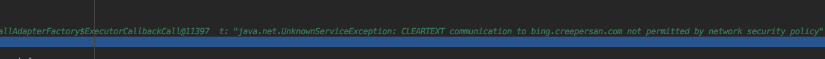

# 【Android】关于Android高版本Http请求失败的原因以及解决方法

## 前言

在学习Retrofit2网络请求框架的过程中写好了代码想向自己的Bing图片中发送Http请求看看是否能够正确的获取到数据。当万事准备好后，运行在安装了Android9.0的Google Pixel上显示连接失败。


## 原因排查

随即检查了下代码，发现是回调了`Callback$onFailure(Call<T>, Throwable)`方法，也就是说这个请求连接失败了。不会吧？难道服务器挂了？遂打开浏览器登上网站，发现一切正常。怎么回事呢？于是打了个断点检查检查。



从断点的提示中可以看到，提示

```txt
java.net.UnknownServiceException:CLEARTEXT communication to bing.creepersan.com not permitted by network secure policy
```

才醒悟到貌似在Android 9.0以上的操作系统中已经默认不允许明文传送的http请求。


## 解决方法1

既然方法已经清晰明了，那么解决方法也很简单。那就是把后台的Api接口迁移到更安全的https上面去。但显然我这里只想做个简单测试。没必要大动干戈，因此没有采用这种方法。


## 解决方法2

这个是我后面采取的解决方法，我们可以定义一个安全的声明性配置文件(xml文件)在其中自定义其网络安全设置。 在`xml`目录下新建一个xml文件，写入所需要信任的域名，如下所示

```xml
<?xml version="1.0" encoding="utf-8"?>
<network-security-config xmlns:android="http://schemas.android.com/apk/res/android">
    <domain-config cleartextTrafficPermitted="true">
        <domain includeSubdomains="true">bing.creepersan.com</domain>
    </domain-config>
</network-security-config>
```

打开`manifest.xml`文件，在`application`的标签下添加入自定义的配置文件

```xml
<?xml version="1.0" encoding="utf-8"?>
<manifest ...>
    <uses-permission android:name="android.permission.INTERNET" />
    <application
        ...
        android:networkSecurityConfig="@xml/你新建的xml安全配置文件名"
        ...>
        ...
    </application>
</manifest>
```


## 解决方法3

这个是在`StackOverflow`上找到的解决方法。可以在`manifest.xml`中指定使用明文流量（Http请求） 把`manifest.xml`修改成如下的方式

```xml
<?xml version="1.0" encoding="utf-8"?>
<manifest ...>
    <uses-permission android:name="android.permission.INTERNET" />
    <application
        ...
        android:usesCleartextTraffic="true"
        ...>
        ...
    </application>
</manifest>
```

不过在使用这个解决方法的同时需要确保是否有在`manifest`中指定`targetSandboxVersion`，如果有，则需要把其值降低为1.因为2就已经代表不适用明文流量(Http请求)和不允许共享UID了


## 参考资料

[网络安全性配置 | Android Developer](https://developer.android.com/training/articles/security-config)

[Android 8: Cleartext HTTP Traffic Not Permitted – Stack Overflow](https://stackoverflow.com/questions/45940861/android-8-cleartext-http-traffic-not-permitted)