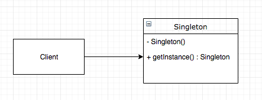

# 【设计模式】单例模式 Singleton

## 前言

单例模式是我们日常开发中使用频率很高的一种软件设计模式。它能保证一个类在全局只有一个实例，并提供了一个访问它的全局访问点。其结构图如图所示



如上图所示，client为获取单例模式对象的调用方，在全局状态下都是通过`getInstance()`方法来获取到单利对象。

## 使用场景

1. 需要一个共享访问点访问共享数据
2. 创建一个需要消耗资源多的对象
3. 一些工具类

## 写法

创建单例模式有6种写法，分别如下，当然这里也没有哪一种方法是绝对的好，关键还是情况选择

1. ### 饿汉模式

   ```java
   public class Singleton {
       private static Singleton mInstance = new Singleton();
   
       private Singleton(){}
   
       public static Singleton getInstance(){
           return mInstance;
       }
       
   }
   ```

   从代码中我们可以看出，饿汉模式在一开始便初始化了类的实例，并且对外隐藏了其构造函数，对外只提供了`getInstance()`方法获取实例。这种在一开始便创建类的实例方式我们称之为“饿汉模式”。使用这种方式由于其在一开始便初始化了类实例，所以避免了多线程使用时的同步问题的同时获取对象的速度也很快，但是这也导致了其加载时的速度较慢，而且如果从始至终都没有使用到这个类的话不仅仅造成了加载时间上的浪费，而且还造成了内存的浪费。

2. ### 懒汉模式（线程不安全）

   ```java
   public class Singleton {
       private static Singleton mInstance = null;
   
       private Singleton(){}
   
       public static Singleton getInstance(){
           if (mInstance == null){
               mInstance = new Singleton();
           }
           return mInstance;
       }
   
   }
   ```

   懒汉模式是在饿汉模式的基础上修改过来的，从代码上我们可以看出二者的区别在于没有在一开始就马上实例化对象，而是在获取对象实例时检测实例是否为空，如果为空则实例化对象并且返回。相比于饿汉模式，这种方式解决了饿汉模式下浪费资源的问题，但是也引入了新的问题。那就是在多线程的情况下同时调用`getInstance()`方法将有可能导致线程不安全的问题，全局情况下可能拥有不止一个实例。

3. ### 懒汉模式（线程安全）

   ```java
   public class Singleton {
       private static Singleton mInstance = null;
   
       private Singleton(){}
   
       public static synchronized Singleton getInstance(){
           if (mInstance == null){
               mInstance = new Singleton();
           }
           return mInstance;
       }
   
   }
   ```

   为了解决上面的问题，这里在获取对象实例的方法变成了同步方法，让其能在多线程的情况下工作。但是在我们没有多线程调用的情况下，每次调用都要进行同步同时也会造成不必要的同步开销。

4. ### 双重检查模式（Double-Check Lock, DCL）

   ```java
   public class Singleton {
       private static volatile Singleton mInstance = null;
   
       private Singleton(){}
   
       public static Singleton getInstance(){
           if (mInstance == null){
               synchronized (Singleton.class){
                   if (mInstance == null){
                       mInstance = new Singleton();
                   }
               }
           }
           return mInstance;
       }
   
   }
   ```

   双重检查模式，顾名思义，就是在获取单例模式实例化对象的时候进行2次判断，第一次判断是在线程不安全的情况下判断是否实例为空，如果为空则进入同步再次确认是否实例化对象为空，如果确实为空则进行实例化然后返回。

   我们也可以看到在声明`mInstance`时使用了`volatile`，这个生命是表示在每次访问这一变量时都会去直接读取其值，确保不会被编译器优化而忽略，禁止该对象上的读写指令重排序。如果没有`volatile`将会有可能导致DCL失效的问题。（限于JAVA5以上，因为JAVA5以前`volatile`只能保证对象的可见性，而JAVA5以后volatile修饰的对象访问时能保证已经初始化完成）

   DCL失效的原因是在于指令重排。为了提高代码的执行效率，JVM会将一些执行频率高的代码编译成机械码，另外对于频率不高的代码则解释执行。一些常见的编译优化方法例如方法内联、去虚拟化、冗余消除等等。在执行`Singleton`的实例化的时候应该是这样的

   ```
   memory = allocate(); //1：分配对象的内存空间
   ctorInstance(memory); //2：初始化对象
   instance = memory; //3：设置instance指向刚分配的内存地址
   ```

   但是经过编译器的优化，则有可能进行指令重排，导致变成这样子

   ```
   memory = allocate(); //1：分配对象的内存空间
   instance = memory; //2：设置instance指向刚分配的内存地址
   ctorInstance(memory); //3：初始化对象
   ```

   这就有可能导致在A线程访问时去实例化对象，执行到2分配内存地址，但是还没有进行初始化。线程B这时调用获取实例方法，就直接返回了没有进行初始化的对象。

   因此，虽然这对性能有一些影响，但是为了确保程序的正确性，这个还是很有必要的。使用这种方式资源利用率高，并且一定程度上解决了资源的消耗与多余的同步。

5. ### 静态内部类单例模式

   ```java
   public class Singleton {
   
       private Singleton(){}
   
       public static Singleton getInstance(){
           return SingletonHolder.mInstance;
       }
       
       private static class SingletonHolder{
           private static final Singleton mInstance = new Singleton();
       }
   
   }
   ```

   在当我们第一次加载`Singleton`的时候并不会去加载`SingletonHolder`，只有当我们第一次调用`SingletonHolder`的时候才会进行加载并初始化。这种方式不仅仅能保证线程安全，而且也能保证其唯一性。因为一个类只有在被使用的时候才会去初始化，而初始化的过程都是非并行的，这写都是由JLS(Java Language Specification，JAVA语言规范)保证的

6. ### 枚举单例

   ```JAVA
   public enum Singleton{
       INSTANCE;
       // 下面为其内部的方法，调用时这样调用 Singleton.INSTANCE.method()
       public void method(){
           
       }
   }
   ```

   默认枚举实例的创建时线程安全的，并且在任何情况下都是单例的。只是其可读性不是很好，而且这样使用也比较少。

## 延伸

其实在上面的方法中，还是有一种情况下会重新创建实例——反序列化。我们将对象实例写入到硬盘中，再通过`readResolve()`方法读取回来，也能获得一个实例，所以如果要防止单利对象被反序列化时重新生成对象，则可以先加入以下方法 rwd

```java
    private Object readResolve() throws ObjectStreamException{
        return mInstance;
    }
```

## 参考资料

[Android进阶之光 - 刘望舒](https://www.jd.com/)

[DCL失效问题的探讨 - 毛蜡烛](https://www.jianshu.com/p/20de25ac4129)