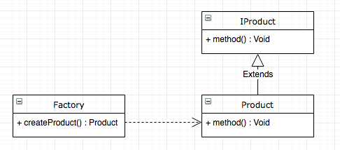

#【设计模式】工厂模式 Factory Pattern

## 前言

工厂模式属于创建型设计模式，其定义一个用于创造对象的接口，让子类决定实例化哪个类。工厂方法使一个类的实例化延迟到其子类。

## 例子

1. ### 简单工厂模式

  + #### 结构

  其结构图如下,其中

  

  Factory : 工厂类，负责创建所有势力的内部逻辑，其创建类的方法可以直接被外部调用，创建所需要的产品对象。

  IProduct : 抽象产品类，其内部描述了了产品所需要实现的方法

  Product : 产品类，由工厂类创建得来，实现了IProduct定义的接口

  + #### 例子

  假如我们以创建对话框为例子，假如我们的对话框有显示功能，那么可以定义如下( IProduct )

  ```java
  public abstract class Dialog {
  
      abstract void showDialog();
  
  }
  ```

  假如我们有两种对话框，一种是显示普通通知的提示对话框和一种显示警告的警告对话框，可以定义如下( Product )

  ```java
  public class MessageDialog extends Dialog {
  
      @Override
      void showDialog() {
          System.out.println("显示消息对话框");
      }
  }
  
  public class AlertDialog extends Dialog {
  
      @Override
      void showDialog() {
          System.out.println("显示警告对话框");
      }
  }
  ```

  最后，负责创建的工厂则可以定义如下

  ```java
  public class DialogFactory {
  
      public Dialog buildDialog(String type) {
          switch (type){
              case  "message" :
                  return new MessageDialog();
              case "alert" :
                  return new AlertDialog();
              default:
                  return null;
          }
      }
  }
  ```

  + #### 使用场景

  工厂类所需要创建的对象比较少

  客户端使用只需要知道工厂类创建产品所需要的参数即可，无需知道其实现过程

  + #### 优点

  降低代码的耦合性，无需客户端自行实现实例化对象的过程

  + #### 缺点

  能实例化的对象在编译器前需要确定。

  如果需要增加新的产品类，那么则需要对工厂类进行修改，这违背了开放封闭原则（软件实体应该对扩展开放，而对修改封闭）。

  如果产品类过多，那么工厂类逻辑实现代码则会变得很长很长

  

2. ### 工厂方法模式

  工厂方法是针对于每一种产品提供一个工厂类，通过不同的工厂实例来创建不同的产品实例。在同一等级结构中，支持增加任意产品。

  + #### 结构

  其结构图如下

  

  Product : 抽象的产品类，描述了产品能执行的操作的接口

  ConcreteProduct : 具体的产品类，实现了Product接口

  Factory : 抽象工厂类，其内部的方法返回了实现了Product接口的产品对象

  ConcreteFactory : 具体的工厂类

  + #### 例子

  同样也是上面的例子为基础，既然是以每一种产品提供一个工厂类，那么我们这里有2个产品（消息对话框和警告对话框），那么我们自然也有2个工厂来创建这两种对话框

  我们的产品也是对话框，所以代码和上面保持一致

  ```java
  public abstract class Dialog {
  
      abstract void showDialog();
  
  }
  
  public class MessageDialog extends Dialog {
  
      @Override
      void showDialog() {
          System.out.println("显示消息对话框");
      }
  }
  
  public class AlertDialog extends Dialog {
  
      @Override
      void showDialog() {
          System.out.println("显示警告对话框");
      }
  }
  ```

  与简单工厂模式不一样的是，这时我们的工厂由抽象工厂创建出来的了，我们的抽象工厂如下

  ```java
  public abstract class DialogFactory {
  
      public abstract Dialog buildDialog();
  
  }
  ```

  由于工厂方法模式是针对每一种产品有一个工厂，那么我们会有两个工厂，分别是消息对话框创建工厂和浸膏对话框创建工厂，代码如下

  ```java
  public class AlertDialogFactory extends DialogFactory {
      @Override
      public Dialog buildDialog() {
          return new AlertDialog();
      }
  }
  
  public class MessageDialogFactory extends DialogFactory {
      @Override
      public Dialog buildDialog() {
          return new MessageDialog();
      }
  }
  ```

  

3. ### 抽象工厂模式

   + #### 结构

     其结构与工厂方法模式类似，这里就不多赘述了。

   + #### 区别

     需要注意的是，抽象工厂模式针对不是每一种产品，而是针对产品族！!

     比如说生产汽车的工厂，在工厂方法模式下，生产白色的汽车一个工厂，生产红色汽车一个工厂。

     在抽象工厂模式中，由针对一种产品变成了针对一族产品，这里以汽车为例的话可以有货车、吉普车等等。那么工厂变成了生产白色汽车、货车、吉普车一个工厂，生产红色汽车、货车、吉普车一个工厂。

     抽象工厂模式是以产品族概念而生，增加新的产品线很容易，但是增加新的产品会很麻烦。

     就上面的来说，增加一个生产蓝色汽车、货车、吉普车的工厂很容易，我直接新开设一家工厂就行了。但是如果要工厂新增一个生产超级跑车的任务的话，则需要对每一个工厂都进行改造。这不符合开放封闭原则。

     如果是工厂方法模式的话，则会有好多好多工厂。。。

   + #### 例子

     这里我们引入一个新的变量——颜色

     工厂对应一个产品族，因此工厂可以定义为下面这个样子

     ```java
     public abstract class DialogFactory {
     
         public abstract Dialog buildMessageDialog();
         public abstract Dialog buildAlertDialog();
     
     }
     ```

     而产品对话框则定义为下面这样

     ```java
     public abstract class Dialog {
     
         abstract void showDialog();
     
     }
     
     public class MessageDialog extends Dialog {
     
         MessageDialog(String color){}
     
         @Override
         void showDialog() {
             System.out.println("显示消息对话框");
         }
     }
     
     public class AlertDialog extends Dialog {
     
         AlertDialog(String color){}
     
         @Override
         void showDialog() {
             System.out.println("显示警告对话框");
         }
     }
     ```

     而，具体的工厂实现可以为这样子

     ```java
     public class RedDialogFactory extends DialogFactory {
         @Override
         public Dialog buildMessageDialog() {
             return new MessageDialog("红色");
         }
     
         @Override
         public Dialog buildAlertDialog() {
             return new AlertDialog("红色");
         }
     }
     
     public class WhiteDialogFactory extends DialogFactory {
         @Override
         public Dialog buildMessageDialog() {
             return new MessageDialog("白色");
         }
     
         @Override
         public Dialog buildAlertDialog() {
             return new AlertDialog("白色");
         }
     }
     ```
     假如我么需要增加一个新的产品族——绿色的对话框的话，我们只需要新建一个工厂即可。但是如果我们需要新增一种选择对话框的话，那么这里就需要修改所有的工厂，并不方便也不符合封闭开放原则。

     ## 参考资料

     [Android进阶之光 - 刘望舒](https://www.jd.com)

   

