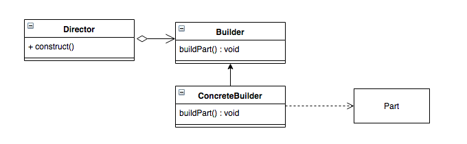

#【设计模式】建造者模式 Builder Pattern

## 前言

建造者模式 ( Builder Pattern ) 也称为生成器模式，它是创建一个复杂对象的创造行模式，其将构建复杂对象的过程和它的部件解耦，使得构建过程和部件的表示分离开来。

其结构图如图所示



**Director** : 导演类，负责安排已有的模块顺序，然后通知Builder开始建造。

**Builder** : 抽象Builder类，规范产品的组建，一般由子类实现

**ConcreteBuilder** : 具体建造者，实现抽象Builder类定义的所有方法，并且返回一个组建好的对象

**Product** : 产品类

## 使用场景

举个例子，假如我们需要组装一台台式电脑主机，那么我们就需要到主板、CPU、显卡、内存、硬盘等等的部件，这些部件使我们都需要的，但是这些部件的选择又有很多种，可以根据自己的实际情况选择不同的部件，但是我们的目的与组装过程都是一样的，那就是组装一台台式电脑主机。针对类似这种情况，我们就可以使用建造者模式，将构造过程与构造过程的部件解耦，使得构造过程和部件都能自由拓展，两者的耦合程度也能降到最低。

当我们需要创建一类对象，他可能会由不同的创建顺序，不同的部件所影响得到细节不同的一类产品。或者是这类产品的部件后面需要拓展的时候，我们可以使用建造者模式。

**优点** :

1. 让客户端不必知道产品内部组成的细节
2. 具体的建造者是独立的，容易拓展，拓展时不容易影响其他部件

**缺点** :

1. 产生多余的Build对象以及导演类


## 例子

我们还是以上面组装台式电脑为例子，首先是我们的产品类**Product**，也就是我们最后组装出来的电脑

```java
public class Computer {
    private String mCPU;
    private String mMainboard;
    private String mDisk;
    private String mGraphicsCard;
    private String mMemory;
    private String mPower;

    public void setCPU(String mCPU) {
        this.mCPU = mCPU;
    }

    public void setMainboard(String mMainboard) {
        this.mMainboard = mMainboard;
    }

    public void setDisk(String mDisk) {
        this.mDisk = mDisk;
    }

    public void setGraphicsCard(String mGraphicsCard) {
        this.mGraphicsCard = mGraphicsCard;
    }

    public void setMemory(String mMemory) {
        this.mMemory = mMemory;
    }

    public void setPower(String mPower) {
        this.mPower = mPower;
    }
}
```

我们假设他有6个部件，如上图所示。

然后就是**Builder**类规范产品的创建，组装台式电脑有一套组装各个部件方法的模板，就是一个抽象的Builder，其里面提供了安装CPU、主板等等部件的方法，以及最后组成台式电脑主机的方法

```java
public abstract class ComputerBuilder {

    public abstract void buildCPU(String cpu);
    public abstract void buildMainboard(String mainboard);
    public abstract void buildDisk(String disk);
    public abstract void buildGraphicsCard(String graphicsCard);
    public abstract void buildMemory(String memory);
    public abstract void buildPower(String power);

    public abstract Computer build();
}

```

接下来是实现了这套规范的子类**ConcreteBuilder**，实现构造各个部件的方法

```java
public class TemplateComputerBuilder extends ComputerBuilder {
    private Computer mComputer = new Computer();

    @Override
    public void buildCPU(String cpu) {
        mComputer.setCPU(cpu);
    }

    @Override
    public void buildMainboard(String mainboard) {
        mComputer.setMainboard(mainboard);
    }

    @Override
    public void buildDisk(String disk) {
        mComputer.setDisk(disk);
    }

    @Override
    public void buildGraphicsCard(String graphicsCard) {
        mComputer.setGraphicsCard(graphicsCard);
    }

    @Override
    public void buildMemory(String memory) {
        mComputer.setMemory(memory);
    }

    @Override
    public void buildPower(String power) {
        mComputer.setPower(power);
    }

    @Override
    public Computer build() {
        return mComputer;
    }
}
```

接下来就是**Director**导演类，负责规范安装的流程顺序，比如说先安装主板，再安装其他的部件，最后再组成我们要的台式主机。这里是由我们自己组装的，所以我们自己就当导演啦，哈哈

```java
public class MeDirector {

    public Computer buildComputer(String cpu, String mainboard, String disk, String graphicsCard, String memory, String power){
        ComputerBuilder mBuilder = new TemplateComputerBuilder(); // 构建组件的方式
        mBuilder.buildCPU(cpu);
        mBuilder.buildMainboard(mainboard);
        mBuilder.buildDisk(disk);
        mBuilder.buildGraphicsCard(graphicsCard);
        mBuilder.buildMemory(memory);
        mBuilder.buildPower(power); // 构建组件的顺序
        return mBuilder.build(); // 构造出台式电脑主机
    }

}
```

最后，就是组装我们的台式电脑主机啦，按照我自己的电脑配置，那应该是这样调用的

```java
        MeDirector me = new MeDirector();
        Computer myConputer = me.buildComputer(
                "Intel core-i7 8700k",
                "Gigabyte Z370 HD3",
                "Samsung 850 EVO 500G",
                "二手 Nvidia GTX 960",
                "USCORSAIR LPX DDR4 8GB x 2",
                "SAMA 80PLUS 550W"
        );
```

## 参考资料

[《Android进阶之光》 - 刘望舒](https://search.jd.com/Search?keyword=android%E8%BF%9B%E9%98%B6%E4%B9%8B%E5%85%89&enc=utf-8&suggest=3.def.0.V19;&wq=android%20jinjie&pvid=8bf6a3723f7d4c8db1a741233c9f42f7)

