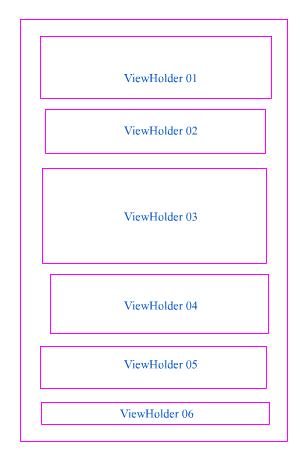
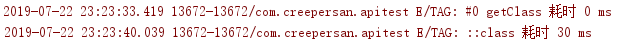
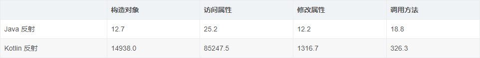

# 【踩坑】Kotlin反射的性能问题

## 缘起

前段时间在给一个`Activity`做性能优化的时候。而且奇怪的是，这个Activity的逻辑并不复杂，仅仅是很平常的ListView展示网络请求和数据库读取返回数据的展示二位而已，而且主线程也没有过多的耗时操作（数据库操作和网络请求都是异步进行的，而且其初始化都是在`Application上`进行的）。但是在第一次加载的时候进入这个Activity的时候，耗时达到了惊人的700-800ms。后面进入就恢复侦察正常了。

## 排查

通过`Profit`查看调用时间时发现一个耗时很严重的地方，进入这个耗时严重的地方查看发现是一个列表的初始化。查看后发现是一个列表的初始化，在这个过程中创建了6种总共6个`ViewHolder`。基本上就是每个`ViewHolder`都有一个Item。

大概长这样

然后其中创建这6个ViewHolder耗时 300-400 毫秒。而且其中耗时分布也很不平均，其中第一ViewHolder耗时比其他的ViewHolder创建耗时多了差不多一个数量级。然后仔细看了看布局，也就比其他的ViewHolder多了一个CardView包裹，多了一个层级而已，应该不至于多这么多时间。

看来问题不在布局，然后查了查初始化，对比了下耗时，初始化的耗时也差不多，那么问题应该是在实例化的时候？

抱着不自信的心情查了查具体实现，找到实例化的代码，是通过反射进行ViewHolder的实例化的，看来问题就出现在反射上了，把反射实例化去掉直接使用类的构造方法实现，编译运行验证，OK，卡顿问题解决。

## 为什么

问题是解决了，虽然反射很强大，但是性能确实不理想，但是也不应该这么夸张把，记得我在别的地方也有使用反射来创建View，但是都没出现这么夸张的耗时问题呀。

查看以前的代码，实在一个for循环里面进行了反射的初始化，不过有点不一样的是，它是使用Kotlin的反射来实例化ViewHoder的，而且耗时都是在第一个反射实例化的时候占用了300ms，但是这个ViewHolder相对其他的ViewHolder也没什么特殊的地方呀，难道是反射的初始化耗时？。

抱着尝试的心情换了初始化的顺序，把第一的顺序换到了最后一个，查看耗时，果然还是第一个（原本的第二个）耗时达到了300ms！

那看来结果八九不离十了，然后上网查阅了一些资料和快速写了一个小Demo【可能不准确】，发现问题还的是Kotlin的反射存在一些性能问题，同样使用反射执行代码

实例化同一个类，里面有一个int和一个String成员参数，里面有一个方法，打印一条日志。结果Java耗时1ms，Kotlin耗时30ms。还有上网查到别人的性能对比表格，从中也是能看到Kotlin的反射相比Java的反射性能上还存在的不小的差距

(图片来自 [Kotlin中文社区 - Kotlin 反射你敢用吗？](https://blog.csdn.net/qq_23626713/article/details/90698516))

## 结论

目前的情况下还是尽量不要使用Kotlin的反射，不仅仅速度慢，而且Kotlin的反射库需要单独引入(2.5M)，增大应用体积。所以，无论是从性能还是体积上考虑，都不是一个很好的选择。(19.07.23)

## 参考资料

[Kotlin中文社区 - Kotlin 反射你敢用吗？](https://blog.csdn.net/qq_23626713/article/details/90698516)