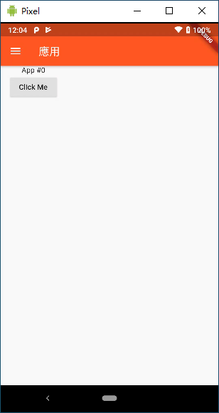
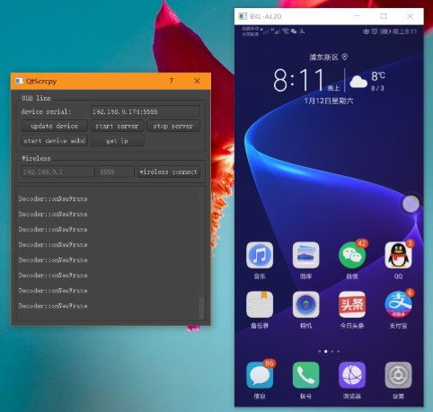

# 【軟件分享】Github上優秀的開源手機投屏軟件推薦

## 前言

Android開發的過程中，最神聖的一步的就是把辛辛苦苦寫好的代碼運行起來啦。由於Android的開放性，許多廠商都或多或少對Android有進行定制化修改，簡單些如Sony、Asus這類廠商修改不多，多的像是MIUI，Emotion、阿里雲OS這些進行了深度定制化的修改。這也造就了Android設備個性十足、百花齊放的盛狀，但是坏的地方也使得Android應用的碎片化，苦了開發者需要面對海量的型號對應不同的系統版本、不同的定制化Rom進行適配。爲了方便調試，得需要在真機上校驗應用的兼容性。其實真機調試也沒什麽不好，麻煩的是要經常擡頭看IDE，低頭戳手機。經過一輪搜索后，本著開（shen）源（shou）的（dang）原則，在排除掉一些收費應用后，在Github上找到2款優秀的手機投屏軟件，這裏給大家分享下

## [scrcpy](https://github.com/Genymobile/scrcpy)

一款優秀的跨平臺Android設備投屏應用，支持Windows、Mac、Linux。 14,501 Stars（截至19/07/09），采用C語言編寫，使用簡單。[點我到下載界面](https://github.com/Genymobile/scrcpy/releases)

Windows下直接下載解壓運行 scrcpy-noconsole.exe 即可進入投屏（前提USB只鏈接上一臺Android設備、打開USB調試並允許此計算機進行調試）。能模擬觸摸操作，鼠標右鍵映射返回鍵，操作方便。

## [QtScrcpy](https://github.com/barry-ran/QtScrcpy)

國内大佬使用Qt編寫的投屏應用，功能强大，支持Wifi無綫投屏，支持游戲按鍵映射，分辨率可調、界面美觀，相比體驗比上面的更流暢更順滑，在使用工具的時候還能看看學學C++，學學Qt。

只是屏幕比例固定了16:9，只有3中分辨率可選，如果比例不符合的話，將會拉伸顯示填充畫面，看上去有點變形 0.0 

不過，這點小問題確實掩蓋不了他的閃光點，這個使用體院上確實要比scrcpy好上不少，確實很好用呀 0w0，[下載戳我](https://github.com/barry-ran/QtScrcpy/releases)

## 尾巴

因不可抗力，IP被封了，VPS失聯1個多月，不得已搬了家，數據從頭開始 (TAT )，雖然説自己技術很菜，縂結不出什么營養，但是會加油逐步提高質量的 (0w0 )

