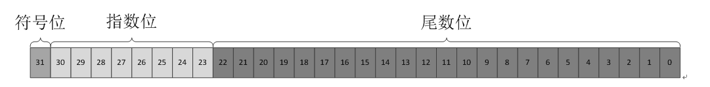

# 【JAVA】 关于Float的最小值

## 前言

在编写自定义折线图控件的时候，为了显示所有的点，需要计算所绘制的线的X轴、Y轴的最大最小值。于是在计算时默认赋予了初始值`Float.MIN_VALUE`，但是却发现当线上所有的点Y轴都比较小的时候，空间绘制出来的线条不正常

## 问题排查

当时计算极限值的代码如下

```kotlin
var minX = Float.MAX_VALUE
var minY = Float.MAX_VALUE
var maxX = Float.MIN_VALUE
var maxY = Float.MIN_VALUE

fun getLimitValue(pointList:List<Point>){
	pointList.forEach({ point ->
		if(point.x > maxX){
            maxX = point.x
        }
        if(point.y > maxY){
            maxY = point.y
        }
        if(point.x < minX){
            minX = point.x
        }   
        if(point.y > minY){
            minY = point.y
        }               
	})
}
```

观察发现当传入的点的集合如果所有的点都小于 0 的话，绘制出来的线段都出现了越界的问题。

检查了N遍代码，感觉没有什么问题呀。

无他法，打断点看看每一步的执行情况，但是却发现初始化时，`maxX`和`maxY`这两个变量值在初始化时的值为`1.4E-45`，也就是`0.0000000000000000000000000000000000000000000014`，这也就是说 `Float.MIN_VALUE`的值并不是所预期的最小值（预期中应该是Float所能表示的最小的数）。问题就在这里

## 问题原因

为什么`Float.MAX_VALUE`的值的却是一个很大的正数，但是`Float.MIN_VALUE`的值却不是一个很小的负数呢？

这就要从`Float`在计算机中的存储结构开始理解了。



`Float.MIN_VALUE` 对应的表示的是 2的负149次方

## 解决方法

所以说，其实`Float.MIN_VALUE`表达的并不是`Float`所能表示的最小数字，而是`Float`所能表示的最小精度 。

其实获得我们“预期中的” `Float.MIN_VALUE`的最小值也很简单，可以直接加负号，也就是 `-Float.MAX_VALUE` 即可获得我们“预期中的” `Float.MIN_VALUE`