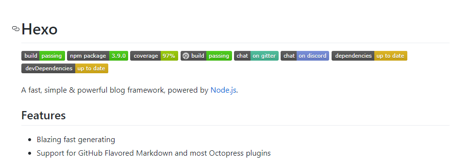

# 【工具分享】给你的Markdown加个酷炫的标签

## 前言

在Github上有十分多优秀的开源项目，同样的，作为优秀的开源项目，自然也少不了丰富的介绍`README.md`，大多数开源项目都有很酷炫的小标签，比如下图这个



可以看到，在`README.md`里面有为数不少的小标签，这些小标签美观的罗列了一些项目的基本信息。那么这些小标签到底是怎么来的呢？

## 一探究竟

这些会是一张张的图片吗？在作者更新的时候再把这些标签图片更新传上来？

这确实是一种方法，但是每次更新都要更新这些标签图片未免有点麻烦。除去这个方法，其实还有更为快捷的方法，我们可以通过这个神奇的网站 [Shield.io](https://shields.io/) 来动态生成标签。

#### 1. 生成一个简单的标签

我们可以通过Markdown的插入图片的语法向 Shield.io 动态请求一张图片，语法如下

```
https://img.shields.io/static/v1?label=<LABEL>&message=<MESSAGE>&color=<COLOR>
```

其中，把`<LABEL>`替换成你要显示的标签文本，`<MESSAGE>`替换成你要显示的文本，`<COLOR>`替换成你想要的颜色就好啦。

例如，这段代码，则会得到下面的显示效果

```
https://img.shields.io/static/v1?label=Name&message=CreeperSan&color=66CCFF
```


#### 2.  指定样式

[Shield.io](https://shields.io/) 不仅仅支持自定义标签内容，还支持自定义标签样式和小图标噢

只需要在标签的网址后面加上以下格式的字符就好啦

```
?style=<STYLE>&logo=<LOGO>
```

把`<STYLE>`替换成对应的样式文本，`<LOGO>`替换成对应的图标，即可看到效果啦

还是以上面的标签来举个例子

```
https://img.shields.io/static/v1?label=Language&message=Kotlin&color=66CCFF&style=for-the-badge&logo=kotlin
```


摇身一变，样式就被替换过来啦

其支持的图标，可以参考 [simpleicons](https://simpleicons.org/) 这个网站里面的图标

官方所直接支持的样式暂时如下

| 样式          | 预览                                                         |
| ------------- | ------------------------------------------------------------ |
| plastic       |  |
| flat          |  |
| flat-square   |  |
| for-the-badge |  |
| social        |  |

#### 3. 指定动态数据

当然的，既然能动态获取标签图像，对于理解数据，理应自然也能动态生成啦，以获取Github上最新Release版本号为例，参考官方文档说明，可以按照这个格式写

```
/github/package-json/v/:user/:repo
```

以 [bing-image](https://github.com/CreeperSan/bing-image) 为例，则可以写成

```
https://img.shields.io/github/package-json/v/CreeperSan/bing-image
```


哈哈，是不是很简单，其实[Shield.io](https://shields.io/)不仅仅支持Github还支持其他很多数据来源噢~比如`npm`、`Homebrew`之类的，关于其他的，就不再赘述啦，可以参考官网提供的方法和生成器。真的很方便噢

## 参考资料

[Shield.io](https://shields.io/)