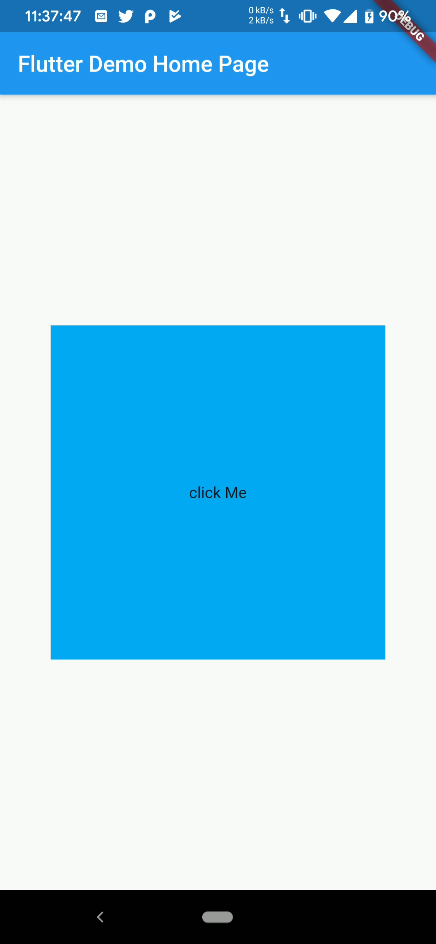

# 【Flutter】关于GestureDetector点击无法响应其下的空白区域

## 前言

Flutter作为一款优秀的跨平台UI框架，前些天还迎来了它的1.9正式版的发布，已经被众多开发者所青睐。今天在写Flutter的一些Demo的时候，写到列表的点击事件，使用的`GestureDetector`发现其包裹着的Widget只有具体有内容的才能出发`onTap`函数，而点击其他空白的地方却不会触发`onTap`。这里做个简单的记录

## 解决方法

当时UI构建的代码如下

```dart
class _MyHomePageState extends State<MyHomePage> {

  @override
  Widget build(BuildContext context) {
    return Scaffold(
      appBar: AppBar(
        title: Text(widget.title),
      ),
      body: Center(
        child: Container(
          width: 300,
          height: 300,
          color: Colors.lightBlue,
          child: GestureDetector(
            child: Center(
              child: Text("click Me"),
            ),
            onTap: (){
              print("click!");
            },
          ),
        )
      )
    );
  }
  
}
```

代码运行渲染的UI是这样的



按照预想应该是点击整块蓝色方块都能响应点击时间，控制台打印出 click! 字符的，然而实际情况却是需要精确点击正中心的 click Me 字符才能正确响应 onTap。

后面上网查询了下，原来只要在GestureDetector里面加入这句话就好了...

```
behavior: HitTestBehavior.opaque
```

添加完成后，代码是这样的

```
class _MyHomePageState extends State<MyHomePage> {

  @override
  Widget build(BuildContext context) {
    return Scaffold(
      appBar: AppBar(
        title: Text(widget.title),
      ),
      body: Center(
        child: Container(
          width: 300,
          height: 300,
          color: Colors.lightBlue,
          child: GestureDetector(
            behavior: HitTestBehavior.opaque,
            child: Center(
              child: Text("click Me"),
            ),
            onTap: (){
              print("click!");
            },
          ),
        )
      )
    );
  }

}
```

然后点击，发现控制台也打印出了 click!

0v0

## 参考资料

[王温暖 - flutter的GestureDetector 点击区域小]( https://blog.csdn.net/cpcpcp123/article/details/94397609)