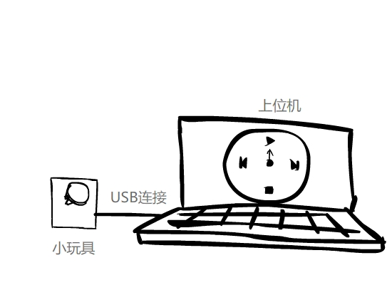

# 【小制作】 做一个简单的快捷控制器 - 01

## 起因

某天在敲键盘的时候在听音乐，想切歌，按照习惯按下了键盘的媒体控制键却按了个空，想起这不是咱自己的键盘。突然奇想，能不能有一个外置的统一控制方式的外置控制器能统一控制方式并且即插即用可移动的小玩具呢？

想了想，实现起来应该是可以的，翻了翻之前剩下的一些小器件，感觉可以拼一个出来

## 思路

根据目前手上有器件，打算使用下面的期间

+ STM8S微控制器
+ 游戏手柄摇杆
+ LED
+ 按键

可以通过指定的通讯协议，保持上位机和小玩具的连接，通过读取数据来记录操作，上位机读取到指定操作后执行。

既然有了游戏手柄遥感，自然的可以做一个圆盘形的小控制器，如下图

首先使用USB进行连接，通过手去操作小玩具，上位机显示对应的控制界面。当松手小玩具回弹，同时上位机执行对应方向的操作。

## 写在最后

大概就是这样，感觉实现起来不难，难就难在怎么样做的好看（处于成本考量，不打算使用PCB板，直接用洞洞板实现了，故居体积也会很大，不过也没啥，也就自己玩玩的小玩具哈哈）。

好久没碰过STM8了（虽然说也就只写过点灯的DEMO，233），希望能尽快做出来玩玩，满足自己折腾的欲望把哈哈