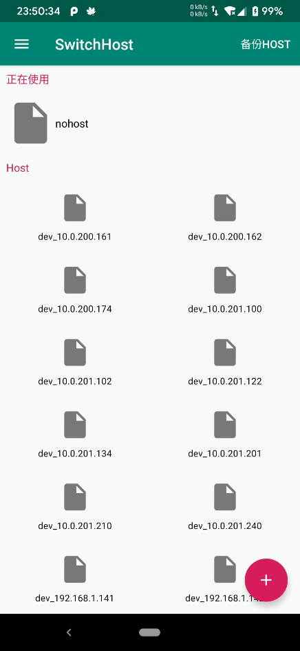
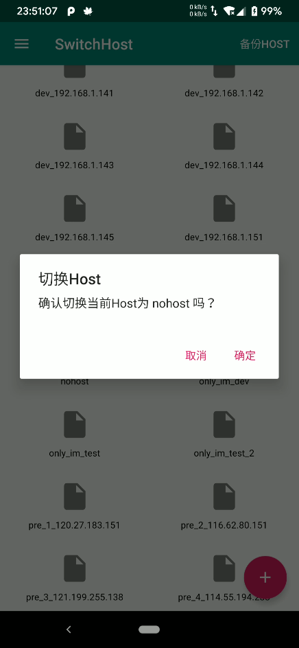
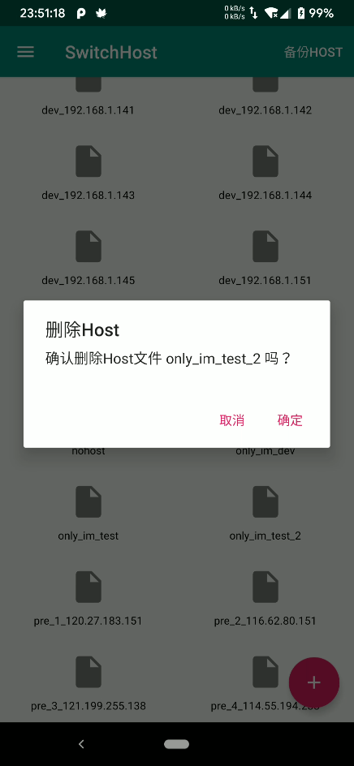
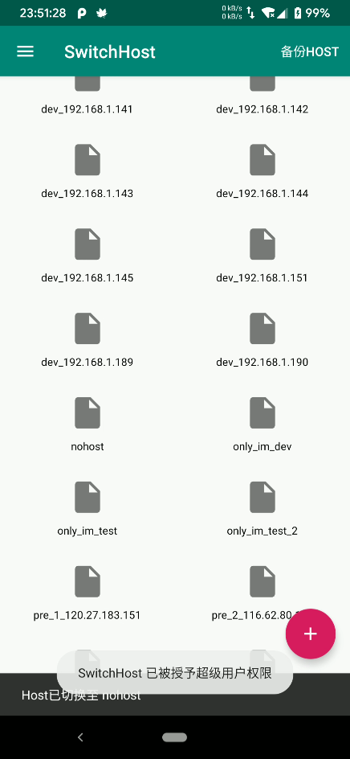

# 【应用分享】SwitchHost-Android 一键切换Android设备的Host ( 需要Root )

## 前言

业余时间尝试写了一个一键切换系统Host的小应用给自己使用，顺便分享一下

## 要求

Android 6.0 及 以上版本

Root 权限

于  Rom为PixelExperience(Android P) 红米Note7  上测试正常

## 功能介绍

+ 一键备份当前系统Host
+ 支持多个host文件一键切换
+ 记录上次使用此应用切换的Host名称

## 截图

## 下载

[SwitchHost.apk](https://github.com/CreeperSan/SwitchHost-Android/releases)

## Github

[SwitchHost-Android](https://github.com/CreeperSan/SwitchHost-Android)

## 实现思路

Android系统的Host文件路径为 `/system/etc/host`， 处于系统分区中，一般应用无法直接访问此分区。

如果有root权限的话还是能访问和修改次分区下的文件的。

由于Android官方并不支持用户root自己的设备。所以，自然Android SDK里面也就没有对用的API，但是一般root玩设备后，都能执行 `su` 命令，因此我们也可以`su`指令判断是否存在权限并且对系统进行修改

可以通过exec方法执行命令，执行的步骤大概有以下

1. 通过 `su` 命令获取root权限
2. 挂载 `system` 分区
3. 使用 `cp` 命令复制替换系统文件
4. 通过 `chmod` 指令修复文件权限

通过这几部即可替换系统文件，需要注意的是以上的指令需要在同一个终端环境下执行。执行命令时可以使用`&&`连接多条指令同时执行。如果指令执行失败的话，返回的 `int` 的值和执行成功返回的 `int` 值是不一样的，一个是1一个是0，通过这个部门就可以判断是否操作成功了。

以上，为核心的操作。总共4个步骤，其实挺简单的，在此故意做个简单的记录。