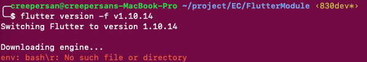
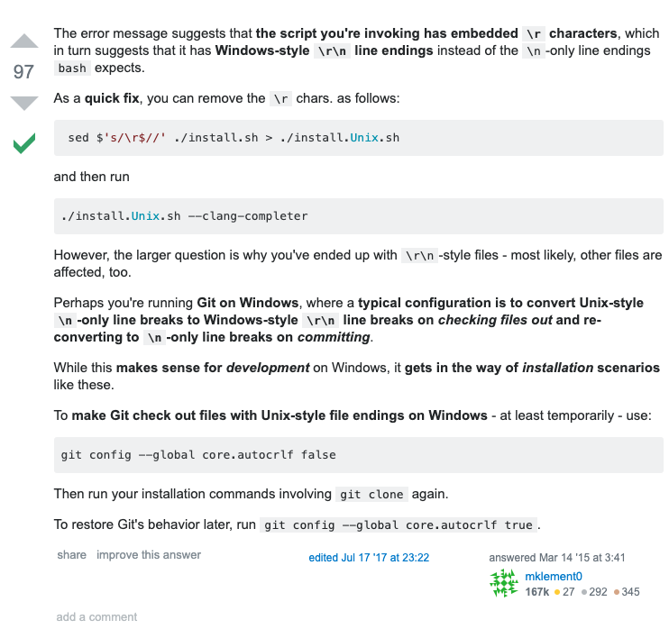
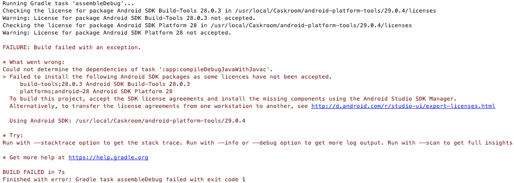
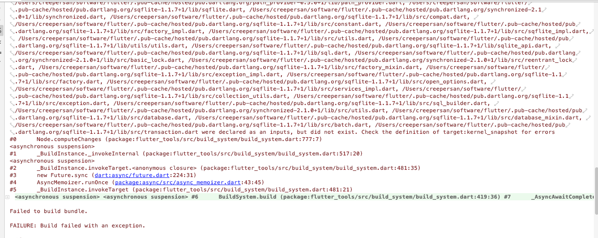

# 【Flutter】3种编译失败的解决方法

原本好好的Flutter运行环境，昨天由于某些原因，需要切换到`v1.10.14`版本。本想着切换版本挺简单的一件事没想到最终却搞了一晚上，这里做个简短的记录，以免再次踩坑。

1. ### 切换version 切换channel失败，并且flutter 命令失效

   首先是切换版本，执行命令`flutter version -f v1.10.14`，没想到终端输出如下

   

   不仅engine没下载下来，后续 flutter 命令也直接挂了，执行 flutter 指令直接报

   ```
   env: bash\r: No suck file or directory
   ```

   经过百度数个小时的爬贴，最终的结果是

   一无所获

   无奈，还是谷歌搜索下，最终发现Github上也有人遇到类似的问题，传送门点这里。

   原因是因为使用了不同的换行符引起的问题

   我使用的是黑苹果，对应换行符为 CR 也就是 `\n`，

   但是由于项目中使用的换行符为 Windows 的换行符 CRLF 也就是 `\r\n`，然后出于方便自己配置了git自动转换换行符为 CRLF，但是这个配置使得flutter在切换version或者切换channel出了问题。

   检查 git 相关配置

   ```bash
   git config core.autocrlf
   git config --global core.autocrlf
   ```

   得到的结果为 true，执行

   ```
   git config --global core.autocrlf false
   ```

   问题解决。

   

   ~~git 为什么不自动识别换行符呢...~~

2. ### Failed to install the following Android SDK packages as some licenses have not been accepted

  点击编译运行，跑了没一会报错

  

  从出错信息来看，应该是对应 licenses 没有 accepted，

  执行指令

  ```
  flutter doctor --android-licenses
  ```

  遇到需要输入的，输入 `y` 一路继续到底，同意所有 licenses，应该就没啥问题了。

  然而重新编译运行，发现同样的错误又出来了

  cd到sdkmanager下，执行

  ```
  ./sdkmanager --licenses
  ```

  重新编译，还是不行

  执行

  ```
  ./sdkmanager "platforms;android-28"
  ./sdkmanager "build-tools;28.0.3"
  ```

  重新编译，还是不行

  删除所有 licenses 然后重新执行上面的指令，还是不行...

  重新安装AndroidSDK、Flutter，然后重复上面的操作

  结果，还！是！不！行！

  最后认真看了看报错信息，发现最后一行

  ```
  Using Android SDK: /balabalabalabala
  ```

  乾！这根本不是我的SDK路径！

  检查项目配置，发现AndroidSDK路径没配置...

  重新配置AndroidSDK路径，问题解决...

3. ### ***.dart were declared as an inputs, but did not exist check the definition of target:kernel_snapshot for errors

   报错如下

   

   把工程目录里面的 `.dart_tool` 删除即可


参考链接

[Changed channel to error 'env: bash\r: No such file or directory' on Mac · Issue #31531 · flutter/flutter](https://github.com/flutter/flutter/issues/31531)

[windows - env: bash\r: No such file or directory - Stack Overflow](https://stackoverflow.com/questions/29045140/env-bash-r-no-such-file-or-directory)

[解决Git 换行符自动转换问题的方法 - petpig0312的博客 - CSDN博客](https://blog.csdn.net/petpig0312/article/details/79838762)