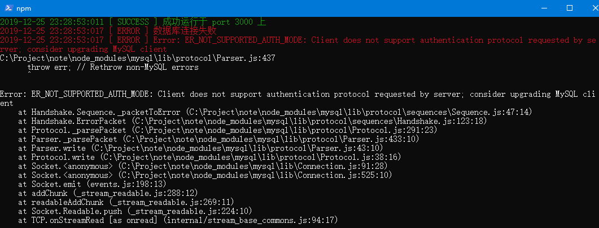

# 【MySQL】解决连接MySQL时报错 ER_NOT_SUPPORTED_AUTH_MODE

## 问题再现

在连接数据库时，Nodejs报错



```
Error: ER_NOT_SUPPORTED_AUTH_MODE: Client does not support authentication protocol requested by server; consider upgrading MySQL client
```

查了下，貌似时 MySQL 8.0 加密方式的原因报错，而去修正这个错误也很简单，这里做下简单的记录

## 解决步骤

首先登陆上 MySQL，按顺序执行下列命令即可

```
use msyql;

alter user 'root'@'localhost' identified with mysql_native_password by '你的MySQL密码';

flush privileges;
```

问题解决，之前的报错也能顺利执行了

