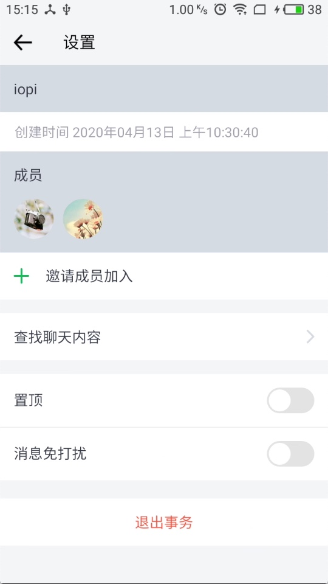
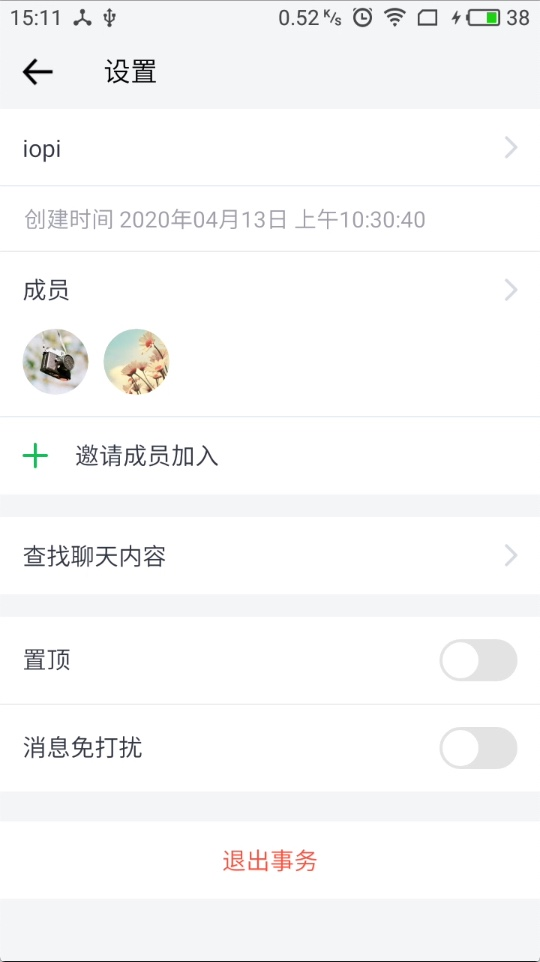

# 【Android】 Drawable xml里layer-list定义的形状在低版本被拉伸的问题

### 问题详情

收到一个反馈提示在魅族M2手机上一个显示兼容问题



设置下方和成员一栏背景展示有问题，按照预期，因该是类似下方置顶选项那样的背景，白色ripple水波纹，下方带一条灰色的分割线。奇怪的是，在我另外的2台设备上展示均正常。

### 问题排查

他提醒我说是不是 `shape` 标签没有定义形状或者颜色，因为在某些机型上他也许默认不是 `rectengle`，检查了xml，问题不是这个。当时的代码如下

```xml
<?xml version="1.0" encoding="utf-8"?>
<selector xmlns:android="http://schemas.android.com/apk/res/android" android:color="@color/huise">
    <item android:state_enabled="true">
        <layer-list>
            <!-- 此处为分割线 -->
            <item>
                <shape android:shape="rectangle">
                    <size android:height="0.5dp"/>
                    <solid android:color="@color/huise_4"/>
                </shape>
            </item>
            <!-- 此处为水波纹 -->
            <item>
                <ripple android:color="@color/huise">
                    <item>
                        <inset android:drawable="@color/background_white_8_0"
                            android:insetBottom="0.5dp"/>
                    </item>
                </ripple>
            </item>
        </layer-list>
    </item>

<!--  当设备为不启用时, 点击将不会有水波纹效果  -->
    <item>
        <layer-list>
            <!-- 此处为分割线 -->
            <item>
                <shape android:shape="rectangle">
                    <size android:height="0.5dp"/>
                    <solid android:color="@color/huise_4"/>
                </shape>
            </item>
            <!-- 此处为背景色 -->
            <item>
                <inset android:drawable="@color/background_white_8_0"
                    android:insetBottom="0.5dp"/>
            </item>
        </layer-list>
    </item>
```

上述代码中也已定义了颜色以及限制了高度为0.5dp。

经过一番查找原因，终于找到了是使用了 `android:gravity="bottom" `这个属性并不支持 API23 以下的设备，因此相关的设置不生效。解决方法可以使用 `inset`标签或者`clip`标签代替。

最终经过权衡使用了`inset`标签解决此问题，`inset`用法表现起来有点类似`padding`。

转变了下思路，让背景色为分割线颜色，而`ripple`背景色为白色，盖在分割线上方，不过底部设置`insetBottom`流出一条缝隙，能看到背后的灰色，看起来就像是分割线了。

修改后的代码如下

```xml
<?xml version="1.0" encoding="utf-8"?>
<selector xmlns:android="http://schemas.android.com/apk/res/android" android:color="@color/huise">
    <item android:state_enabled="true">
        <layer-list>
            <item>
                <ripple android:color="@color/huise">
                    <item>
                        <color android:color="@color/background_white_8_0"/>
                    </item>
                </ripple>
            </item>
            <!-- 此处为分割线 -->
            <item android:gravity="bottom">
                <shape android:shape="rectangle">
                    <size android:height="0.5dp"/>
                    <solid android:color="@color/huise_4"/>
                </shape>
            </item>
        </layer-list>
    </item>

<!--  当设备为不启用时, 点击将不会有水波纹效果  -->
    <item>
        <layer-list>
            <item>
                <color android:color="@color/background_white_8_0"/>
            </item>
            <item android:gravity="bottom">
                <shape android:shape="rectangle">
                    <size android:height="0.5dp"/>
                    <solid android:color="@color/huise_4"/>
                </shape>
            </item>
        </layer-list>
    </item>


</selector>
```

修改后的展示效果是这样的，也恢复了正常



### 参考链接

[act262 - layer-list被拉伸问题](https://www.jianshu.com/p/7c42fd04fb42)

https://www.jianshu.com/p/34ac5965533d
