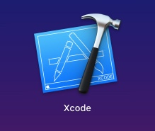
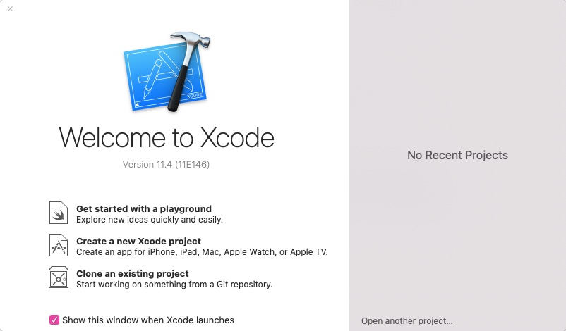
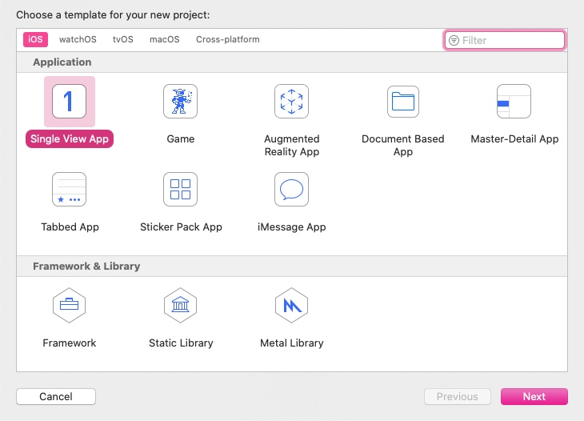
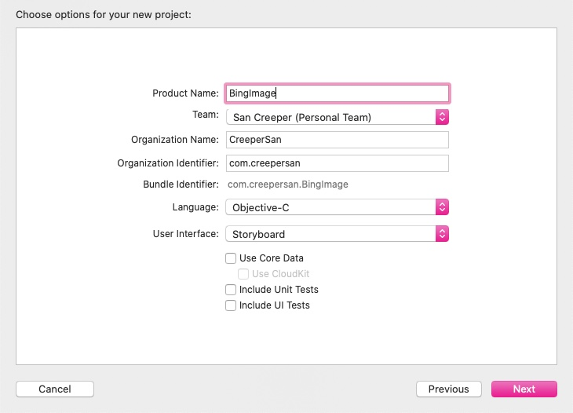
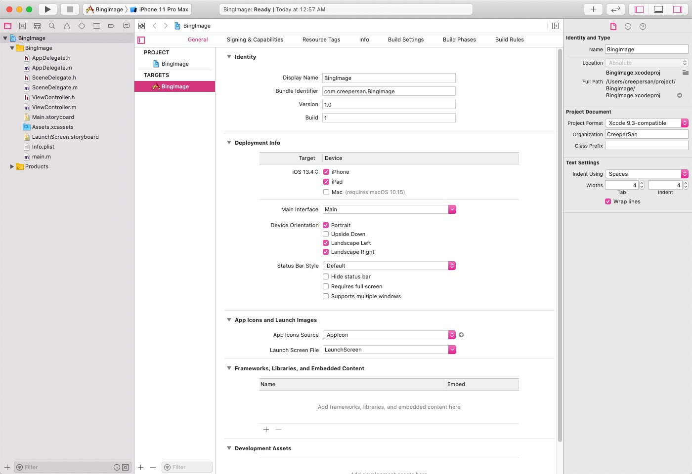
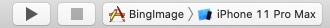
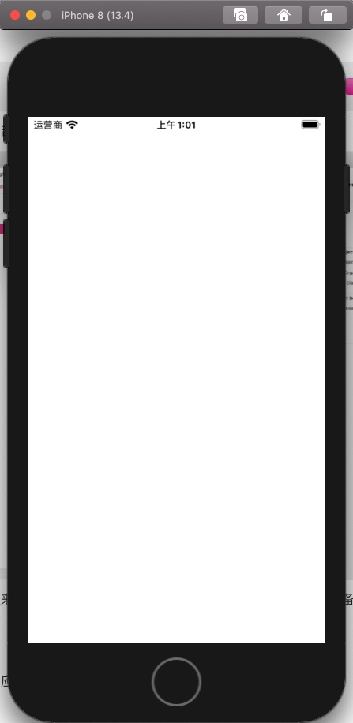
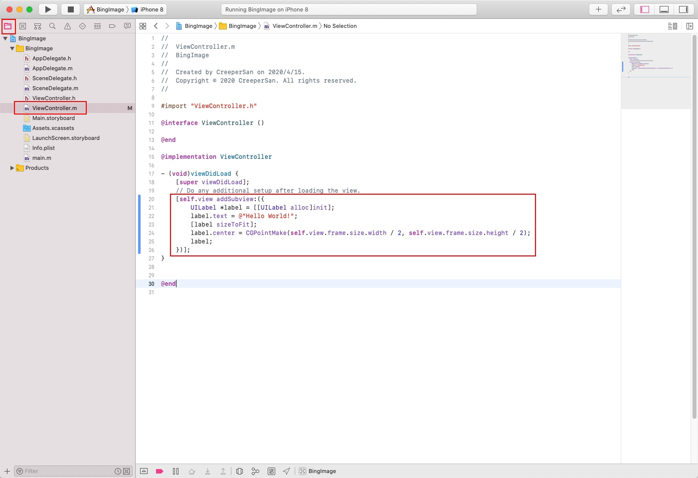
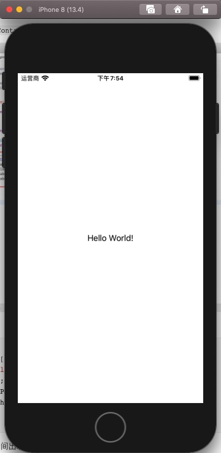

# 【从零开始的iOS应用开发之旅 - 01】创建第一个iOS项目工程

### 前言

> 这里开了个新坑，用于记录自己在自学iOS开发的一些历程，对涉及到相关知识进行归纳总结，方便日后查阅方便。目标是以 [BingImage](https://github.com/CreeperSan/bing-image-android) 为蓝本完成一个简单但完整的iOS应用。新手上路，难免会有一些地方存在错误，希望各位大侠不吝赐教，谢谢！

### 准备工作

工欲善其事，必先利其器。在进行iOS开发之前必须得先准备好iOS的相关开发环境。需要准备的内容如下

1. Mac OS 操作系统（白苹果、黑苹果、虚拟机任君选择）
2. XCode

只需要以上2点即可，开发iOS应用，MacOS是必不可少的。如果不是使用苹果电脑也可以尝试安装黑苹果，安装黑苹果的过程相对比较麻烦，而且还得取决你的硬件。至于安装方法不在本篇讨论范围之内，因此不进行展开。当然，也有更简单的方法，就是使用虚拟机虚拟MacOS系统环境，相关的方法网上总结经验也不少，随便百度也能找到，因此也不做展开。

MacOS系统准备就绪后，可以在系统自带的应用商店里面搜索 `XCode` 下载安装即可

### 创建你的第一个iOS工程

当XCode安装完成后，你可以在你的 启动台 中找到XCode，单击打开



打开后，显示的是一个最基本的欢迎界面，由于我这里是需要创建一个新的工程，所以选择 `Create a new XCode project`



选择后会弹出一个这样的界面，询问我们需要创建的工程的模版，此处有针对不同平台的多套模版可以选择。在这里我选择了`Single View App` 一个具有单一界面的app，点击`next`进行下一步



接下来来到一些信息填写的界面，根据实际情况填入相关信息

Product Name 意为应用名称

Team 为团队，我这里已经创建了一个团队，当然你也可以使用None

Organization Name 为组织名称，这里我直接填了自己的名称

Organization Identifier 为组织标识，一般为域名的反写。比如 google.com 为 com.google

Language 为所选用的开发语言，我这里选用的 Objective-C

User Interface 为UI方案，我这里选择的是StoryBoard，你也可以尝试SwiftUI，与Flutter有点像

Use Core Data 为是否启用一些基本的数据库操作，这里我暂时没有勾选上

Include Unit Tests 为是否引入单元测试，这里我没有勾选

Include UI Tests 为是否引入UI测试，这里我没有勾选



按照需要填写上面的信息后，点击 `next` 选择工程保存路径点击 `create`， 工程就创建好了



此时我们可以点击右上角的看起来像是播放按钮的编译运行按钮，当然你也可以点击右边的设备名称指定设备运行的模拟器或者真机



等待编辑安装结束，就可以看到应用已经运行了起来。因为我们也还没有编写相关的代码，如无意外应该是一片空白的界面。



至此，一个基本的iOS工程就已经运行了起来，此时我们可以看到一个空白的应用运行了起来。

### Hello World!

接下来，国际惯例，我们可以在中间显示一行Hello World的文本。

首先先找到工程目录下的 `ViewController.m` 文件



写入以下代码

```objective-c
    [self.view addSubview:({
        // 创建文本视图
        UILabel *label = [[UILabel alloc]init];
        // 设置文本试图要显示的文字
        label.text = @"Hello World!";
        // 设置文本视图的视图大小
        [label sizeToFit];
        // 设置文本视图的位置为中央
        label.center = CGPointMake(self.view.frame.size.width / 2, self.view.frame.size.height / 2);
        // 返回文本视图
        label;
    })];
```

点击运行，可以看到，应用的中间出现了 Hello World! 的文本。



