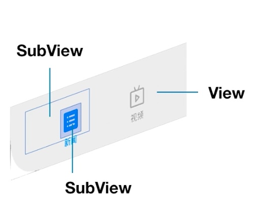
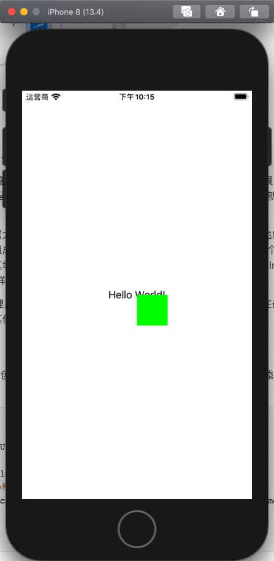
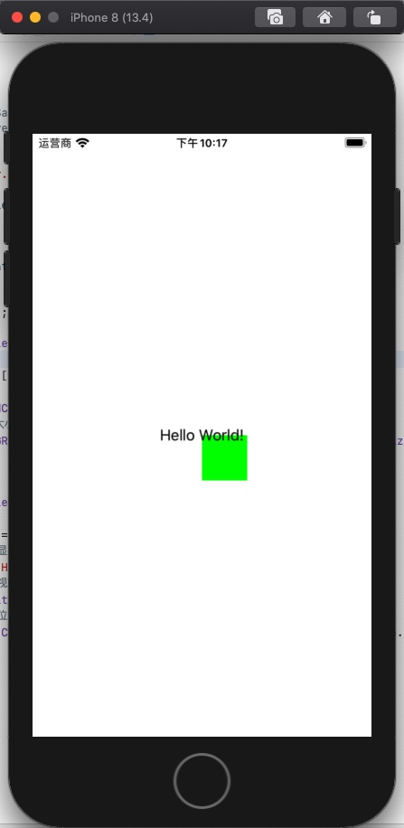

# 【从零开始的iOS应用开发之旅 - 02】关于视图管理的那些事

### 所谓视图 View

在一个APP的使用过程中，能和我们直接交互的就是APP的界面，而APP的界面是由多个视图组成的。而视图就是所有在APP中可以看到的内容，包括图片、文字、视频等等。

### 所谓数据 Model

我们打开APP使用，是为了消费或者生产信息。既然我们在上面已经有了视图，而对应的这些信息自然也就有了展示的载体。展示在视图上的这些信息，就是数据

### 所谓管理 Controller

既然数据我们有了，视图也有了，那么我们就可以以一种我们想要的方式把我们的数据展示在视图之上。而如何去展示、其具体的显示、操作逻辑，就是管理，管理数据如何在视图上展示的一个过程

### 所谓MVC

MVC也就是把上面的内容集合在一起，数据、视图、管理。数据表明了视图需要展示的内容，而管理则是管理数据如何在视图中显示。

在iOS应用中，不管基础的组件、单一的页面、整个应用的结构都是遵循这样的一套MVC结构，在应用中，所有的视图都是通过 `UIView` 进行展示，所有的管理都是通过 `UIViewController` 进行管理。

### UIView

在上面已有说明，所有的视图都是通过`0UIView`进行展示



比如下图中的图标、文字、以及一整块布局都是 `UIView` 进行展示。

`UIView` 作为最基础的视图类，管理着屏幕上一定区域的内容展示。根据其功能的细分，有着展示不同内容的`View`，比如展示图片的`UIImageView`，展示文本的`UILabel`。因此对于`UIView`来说，其作用就是渲染不同的内容。

UIView也允许我们在之中布局（大小、位置frame）、管理和添加子视图（addSubView）。也就是说我们也可以把不同的UIView组合到一起，组成更复杂的组件，从而组成更为复杂的页面。比如上图中，整个背景的灰色就是一个UIView，我们可以在一些区域增加上UIView，用于点击。而在点击的里面，又可以添加UIImageView和UILabel组成一个图标。通过这样子的组合，可以呈现出复杂的界面。

UIView使用栈对子View进行管理，如果子View出现重叠的问题，则最后入栈的View将会展示在最前面。我们可以通过代码动态View的位置等等其他的属性。

### 代码

我们可以通过代码来验证，首先创建一个UIView。回到刚才的代码，在 `viewDidLoad` 里面，添加UILabel的后面添加展示一个自定义的UIView

```objective-c
[self.view addSubview:({
        // 创建UIView
        UIView *view = [[UIView alloc] init];
        // 设置背景颜色
        view.backgroundColor = [UIColor greenColor];
        // 设置UIView的大小和位置
        view.frame = CGRectMake(self.view.frame.size.width / 2, self.view.frame.size.height / 2, 50, 50);
        view;
    })];
```

运行查看结果，应该能看到一个绿色的正方形出现在了应用界面上



而且由于UIView是后面才通过`addSubView`添加到栈中，因此位于栈顶，所以显示在了最上面，把Hello World!遮住了。

我们可以尝试交换2段代码的位置，让UILabel后添加，这样UILabel就会位于栈顶，就能显示在最上面，盖在绿色正方形之上



### UIView的生命周期

UIView常用的生命周期方法如下

| 函数名称            | 功能                               |
| ------------------- | ---------------------------------- |
| willMoveToSuperview | 将要把自身添加到父UIView中         |
| didMoveToSuperview  | 自身已经添加到父UIView中           |
| willMoveToWindow    | 将要把自身和父UIView添加到Window中 |
| didMoveToWindow     | 已经把自身和父UIView添加到Window中 |

我们可以编写测试代码，创建一个自定义的UIView，并在生命周期中打印输出Log，观察其执行流程。

把ViewController.m代码修改成这样

```objective-c
#import "ViewController.h"

@interface ViewController ()

@end

@interface TestView : UIView
@end

@implementation TestView

- (void)didAddSubview:(UIView *)subview{
    NSLog(@"didAddSubview");
}
- (void)willRemoveSubview:(UIView *)subview{
    NSLog(@"willRemoveSubview");
}
- (void)willMoveToSuperview:(nullable UIView *)newSuperview{
    NSLog(@"willMoveToSuperview");
}
- (void)didMoveToSuperview{
    NSLog(@"didMoveToSuperview");
}
- (void)willMoveToWindow:(nullable UIWindow *)newWindow{
    NSLog(@"willMoveToWindow");
}
- (void)didMoveToWindow{
    NSLog(@"didMoveToWindow");
}

@end

@implementation ViewController

- (void)viewDidLoad {
    [super viewDidLoad];
    
    TestView *view = [[TestView alloc]init];
    [self.view addSubview:view];
}


@end
```

运行代码，可以看见控制台输出日志如下

```
2020-04-15 22:45:28.498331+0800 BingImage[1319:91838] willMoveToSuperview
2020-04-15 22:45:28.498504+0800 BingImage[1319:91838] didMoveToSuperview
2020-04-15 22:45:28.505547+0800 BingImage[1319:91838] willMoveToWindow
2020-04-15 22:45:28.505753+0800 BingImage[1319:91838] didMoveToWindow
```

由此可见，当我们通过`addSubView`方法添加UIView时，UIView内部执行流程为

1. `willMoveToSuperView`
2. `didMoveToSuperView`
3. `willMoveToWindow`
4. `didMoveToWindow`

### UIViewController

UIViewController，视图控制器，其作用是管理视图View层级结构和生命周期、响应用户操作、APP整体交互、视图切换以及作为一个container管理多个Controller和动画。

界面上的一段视频、一张图片到一张图片，其背后都有一个UIViewController对其显示逻辑进行管理

其自身不仅仅是一个控制器，其内部还包含了一个View（DefaultView），可以理解为一个容器，管理容器内部的UIView。不管是任意一个UIViewController，系统都会在它创建的时候提供一个默认的View。当创建View的时候，我们把自己的View添加到ViewController的View中，从而就完成了数据的展示。

### UIViewController的生命周期

UIView常用的生命周期可以总结出以下几个

| 函数              | 作用                                                   |
| ----------------- | ------------------------------------------------------ |
| init              | UIViewController在初始化中重载的函数                   |
| ViewDidLoad       | UIView自身的DetaultView已经创建                        |
| ViewWillAppear    | 整个UIViewController的默认视图和子视图即将在屏幕中出现 |
| ViewDidAppear     | 整个UIViewController的默认视图和子视图已经在屏幕中出现 |
| ViewWillDisappear | 整个UIViewController的默认视图和子视图即将在屏幕中消失 |
| ViewDidDisappear  | 整个UIViewController的默认视图和子视图已经在屏幕中消失 |
| Dealloc           | UIViewController被释放                                 |

同样的，可以编写测试代码，重载生命周期中的函数，输入对应的语句，观察其输出顺序得出其执行过程。

将代码修改成如下

```objective-c
#import "ViewController.h"

@interface ViewController ()

@end

@implementation ViewController

- (void)viewDidLoad {
    [super viewDidLoad];
    NSLog(@"viewDidLoad");
}

- (void)viewWillAppear:(BOOL)animated{
    NSLog(@"viewWillAppear");
}

- (void)viewDidAppear:(BOOL)animated{
    NSLog(@"viewDidAppear");
}

- (void)viewWillDisappear:(BOOL)animated{
    NSLog(@"viewWillDisappear");
}

- (void)viewDidDisappear:(BOOL)animated{
    NSLog(@"viewDidDisappear");
}

@end
```

编译运行，可以看到应用启动时日志输出如下

```
2020-04-15 23:05:38.238631+0800 BingImage[1385:104489] viewDidLoad
2020-04-15 23:05:38.244335+0800 BingImage[1385:104489] viewWillAppear
2020-04-15 23:05:38.258859+0800 BingImage[1385:104489] viewDidAppear
```

由此可见，当UIViewController启动时，执行的顺序如下

1. `viewDidLoad`
2. `viewWillAppear`
3. `viewDidAppear`