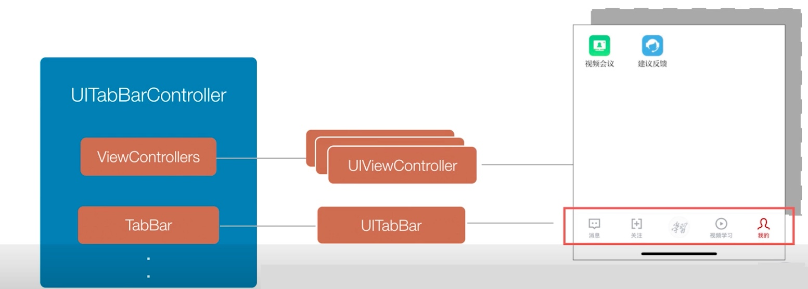

# 【从零开始的iOS应用开发之旅 - 03】UITabBarController - UIViewController之间的切换与管理

> | 快捷键              | 作用                 |
> | ------------------- | -------------------- |
> | shift + command + o | 跳转至已知的类、函数 |
> | command + r         | 编译运行             |

### 前情提要

前面我们提到UIViewController可以对UIView进行数据的展示（给UILabel设置展示的文本、给UIView设置背景颜色等等），我们任何一个页面都可以在上面添加UIView来实现我们需要的展示效果。

### UIViewController的页面切换简单理解

同时，UIViewController也能在多个UIViewController之间进行切换。怎么理解呢？以iOS系统自带的健康应用举例


我们可以看到，应用界面存在2个标签页，摘要和浏览。我们可以理解为，整个应用程序下是一个标签页的UIViewController，管理着摘要UIViewController和浏览ViewController。当我们点击浏览下的类别时，可以看到浏览前进到了具体的统计信息，同理可以得出，浏览UIViewController也管理着下面详细信息的UIViewController。

### UITabBarController

既然上面提到了标签页切换的UIViewController，就以这个距离，SDK中已有了这样功能的UIViewController ，其名称为 `UITabBarController`

截取几张视频内的图片结合我们日常使用App的场景，不难看出




UITabBarController的功能就是管理多个UIViewController的切换，通过点击底部的按钮，展示出对应的页面，一般展示2-5个点页面。

因此UITabBarController会持有供其切换的多个UIViewController，并且还有一个用于展示底部按钮的UITabBar完成展示于交互。

并且UITabbarController按照加入顺序依次展示UIViewController

### UITabbarController快速使用！

既然说了些相关概念，下面我们可以动手创建一个UITabbarController来感受下实际的展示效果。

由于在工程创建的时候，我们创建的是iOS的单一页面的工程，因此如果想要使用UITabbarController，还需要做一点修改。

首先我们找到 `SceneDelegate.m`，在 `willConnectToSession` 函数中，加入以下代码

```objective-c
    self.window = [[UIWindow alloc] initWithWindowScene: (UIWindowScene *)scene];
    
    UITabBarController *tabBarController = [[UITabBarController alloc] init];
    
    UIViewController *controller1 = [[UIViewController alloc] init];
    controller1.view.backgroundColor = [UIColor yellowColor];
    controller1.tabBarItem.title = @"图库";
    
    UIViewController *controller2 = [[UIViewController alloc] init];
    controller2.view.backgroundColor = [UIColor greenColor];
    controller2.tabBarItem.title = @"壁纸";
    
    UIViewController *controller3 = [[UIViewController alloc] init];
    controller3.view.backgroundColor = [UIColor cyanColor];
    controller3.tabBarItem.title = @"更多";
    
    [tabBarController setViewControllers: @[controller1, controller2, controller3]];
    
    self.window.rootViewController = tabBarController;
    [self.window makeKeyAndVisible];
    
```

点击运行，可以应用运行了起来


当我们点击下方按钮时，其背景颜色也跟着发生了改变，这说明我们的UITabBarController已经正确的进行了切换

当然我们也注意到，现在底部的tab还没有图标，我们可以在这里为其添加上我们的图标。

### 为UITabBarViewController的底部按钮添加图标

既然是要添加图标，那么少不了的自然就是图片了，首先先准备对应的图片文件

然后找到 `Assets.xcassests` 这个文件，单击文件，在打开的窗口中鼠标右击，选择 `New Image Set`


输入图标的名称，然后把对应的图片拖动到右侧对应放大倍数的方框中，添加完成后的列表展示如下


接下来就是把对应的图标设置到 ViewController 中去啦，对应的设置代码为

```objective-c
controller2.tabBarItem.image = [UIImage imageNamed:@"图片名称"];
```

添加图标完成后，整体函数的代码为

```objective-c
- (void)scene:(UIScene *)scene willConnectToSession:(UISceneSession *)session options:(UISceneConnectionOptions *)connectionOptions {
    
    self.window = [[UIWindow alloc] initWithWindowScene: (UIWindowScene *)scene];
    
    UITabBarController *tabBarController = [[UITabBarController alloc] init];
    
    UIViewController *controller1 = [[UIViewController alloc] init];
    controller1.view.backgroundColor = [UIColor yellowColor];
    controller1.tabBarItem.title = @"图库";
    controller1.tabBarItem.image = [UIImage imageNamed:@"ic_gallery_nav_gray"];
    
    UIViewController *controller2 = [[UIViewController alloc] init];
    controller2.view.backgroundColor = [UIColor greenColor];
    controller2.tabBarItem.title = @"壁纸";
    controller2.tabBarItem.image = [UIImage imageNamed:@"ic_bing_nav_gray"];
    
    UIViewController *controller3 = [[UIViewController alloc] init];
    controller3.view.backgroundColor = [UIColor cyanColor];
    controller3.tabBarItem.title = @"更多";
    controller3.tabBarItem.image = [UIImage imageNamed:@"ic_more_nav_gray"];
    
    [tabBarController setViewControllers: @[controller1, controller2, controller3]];
    
    self.window.rootViewController = tabBarController;
    [self.window makeKeyAndVisible];
    
}
```

编译运行，可以看到，对应的图片已经设置到底部TabBar上面了


