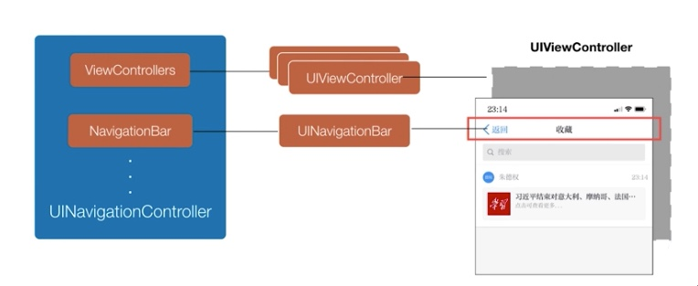
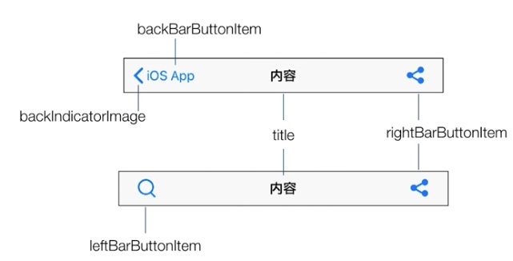
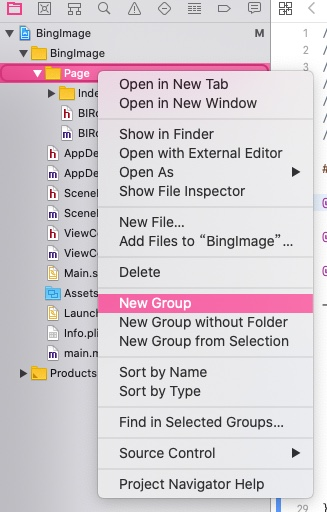
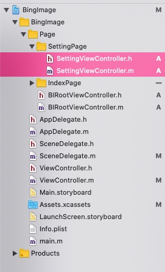
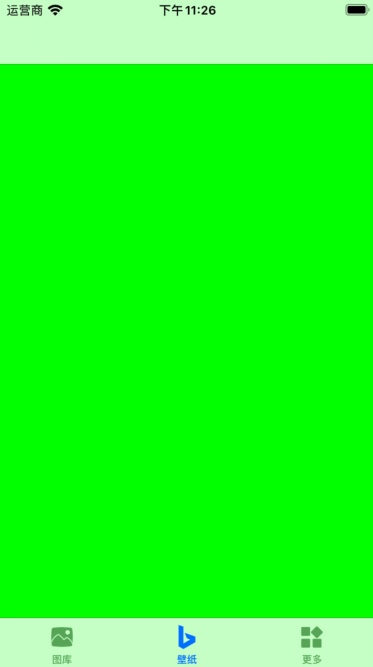
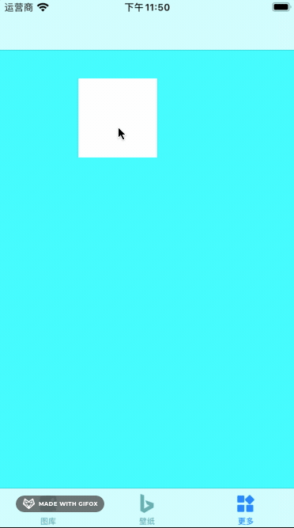

# 【从零开始的iOS应用开发之旅 - 04】UINavigationController管理页面的跳转

### 前情提要

之前我们了解到，UITabBarController是一个能提供一个页面下，多个UIViewController同屏切换的一个ViewController。这种类似的操作逻辑在众多App中大量出现。但是还存在另外一种大量应用情景，UITabBarController无法实现...

### 是什么情景呢

还有一种大量使用的情景，那就时多个ViewController进行跳转。类似的有比如微信订阅号点击推送的文章跳转到文章详情、系统设计点击选择蓝牙跳转到搜索蓝牙设备列表。类似这样子的需要页面跳转到情景，UITabBarController便无能为力了。

要实现如此的页面跳转逻辑，我们可以使用这个 `UINavigationController`

### UINavigationController

UINavigationController于UITabBarController有一个很大的不同，那就是它不像UITabBarController那样有一个UITabBar用于展示自身的界面（底部按钮这些）。UINavigationController默认是没有界面展示，显示到屏幕上就时一个全黑的界面。我们可以使用`initWithRootController` 来为其指定一个展示的ViewController。

UINavigationController的内维持了一个ViewController的栈，我们可以使用 `pushViewController` 函数往栈中压入一个新的ViewController。而在栈最上面的ViewController就会得以展示。给我们视觉上感受到的就是打开了一个新的界面。

一个通俗类比Android（虽然不恰当），UITabBarController就像是ViewPager，而想要startActivity就必须借助UINavigationController的navigationController进行界面的跳转。

UINavigationController内部结构大致是这样的



其内部维护了一个ViewController的栈，这些ViewConroller就是我们界面里的一个个界面。我们通过其提供的push和pop方法跳转新的界面和返回上一层界面操作的就是里面的栈。并且UINavigationController还提供了一个默认的导航栏NavigationBar，给予了我们默认的返回上一层的操作以及标题展示（也就是上图中的红框部分）。

### UINavigationBar



UINavigationBar位于UINavigationController的顶部，而且随着顶部的UIViewController变化也同步发生变化。一般由左、中、右三部分组成。

左边默认是提供返回操作的按钮，当然你也可以进行自定义，设置你的按钮和对应的点击事件上去。

中间部分一般显示当前UIViewController标题，当然需要你去设置

右侧默认是没有展示内容的，你可以根据自己的需要设置一些自定义的按钮上去

### UINavigationController的快速使用

在BingImage的应用中，我想要实现的效果更多这个tab页里面的有一个设置选项，点击设置选项后整个界面（包括底部的tabbar也要跟着界面入栈）都跳转为详细的设置界面。就像在微信中点击设置页一样（Version 7.0.14）。

那么要实现这种效果首先先创键一个新的设置VC出来，为了将工程里面的文件，我们先新建一个Group来存放设置界面的相关代码，如下图所示



右键选择 New Group，创建设置页面的Group然后再按照之前的方法创建新的VC（由于忘记截图，其他的页面我也按照类似的办法进行了分类）

添加完成后，工程结构如图所示（只看选中的两个文件、其他的可以忽视）



设置的VC为了辨认，我们就把他的标题栏显示 “设置” 这个字符串展示把，在 SettingViewController.m 的 `viewDidLoad()` 方法中加入以下代码

```objective-c
self.title = @"设置";
```

这样就完成了标题文本的设置

接下来就是在更多这个Tab中完成跳转了。

由于在之前关于 TabBarViewController 的使用中，我们已经把最外层的VC换成了 TabBarController ，因此需要实现设想中的跳转，还需要再 TabBarViewController 外面套一层 UINavigationController。

找到 SceneDelegate.m 文件中的 `willConnectToSession` 方法

修改为代码

```objective-c
- (void)scene:(UIScene *)scene willConnectToSession:(UISceneSession *)session options:(UISceneConnectionOptions *)connectionOptions {
    
    self.window = [[UIWindow alloc] initWithWindowScene: (UIWindowScene *)scene];
    
  	// TabBarViewController的设置
    UITabBarController *tabBarController = [[UITabBarController alloc] init];
    ViewController *viewController = [[ViewController alloc] init];
    viewController.view.backgroundColor = [UIColor yellowColor];
    viewController.tabBarItem.title = @"图库";
    viewController.tabBarItem.image = [UIImage imageNamed:@"ic_gallery_nav_gray"];
    UIViewController *controller2 = [[UIViewController alloc] init];
    controller2.view.backgroundColor = [UIColor greenColor];
    controller2.tabBarItem.title = @"壁纸";
    controller2.tabBarItem.image = [UIImage imageNamed:@"ic_bing_nav_gray"];
    UIViewController *controller3 = [[UIViewController alloc] init];
    controller3.view.backgroundColor = [UIColor cyanColor];
    controller3.tabBarItem.title = @"更多";
    controller3.tabBarItem.image = [UIImage imageNamed:@"ic_more_nav_gray"];
    [tabBarController setViewControllers: @[viewController, controller2, controller3]];
    
    // 设置最外层VC
		UINavigationController *rootViewController = [[UINavigationController alloc] initWithRootViewController:tabBarController];
    self.window.rootViewController = rootViewController;
    [self.window makeKeyAndVisible];
    
}
```

编译代码启动，我们可以看到顶部出现了一个默认的标题栏UINavigationBar，说明最外层已经被替换成了UINavigationController。



接下来就是在更多的Tab页下增加跳转选项了，这个应该使用UITableViewController实现，由于内容也不少，这里就先直接使用一个简单的UIView当做选项实现了

在上面的 controller3 后面、navigationController的前面增加代码

```objective-c
    UIView *btnView = [[UIView alloc] init];
    btnView.backgroundColor = [UIColor whiteColor];
    btnView.frame = CGRectMake(100, 100, 100, 100);
    
    UITapGestureRecognizer *recognizer = [[UITapGestureRecognizer alloc] initWithTarget:self action:@selector(onSettingTap)];
    [btnView addGestureRecognizer:recognizer];
    
    [controller3.view addSubview: btnView];

    [tabBarController setViewControllers: @[viewController, controller2, controller3]];
```

并在同一个文件下增加点击事件的响应方法 `onSettingTap`

```objective-c
- (void) onSettingTap {
    SettingViewController *controller = [[SettingViewController alloc] init];
    controller.view.backgroundColor = [UIColor whiteColor];
    [((UINavigationController*)self.window.rootViewController) pushViewController:controller animated:YES];
}
```

全部修改后，SceneDelegate.m将会是类似这个样子

```objective-c
#import "SceneDelegate.h"
#import "BIRootViewController.h"
#import "ViewController.h"
#import "SettingViewController.h"

@interface SceneDelegate ()

@end

@implementation SceneDelegate


- (void)scene:(UIScene *)scene willConnectToSession:(UISceneSession *)session options:(UISceneConnectionOptions *)connectionOptions {
    
    self.window = [[UIWindow alloc] initWithWindowScene: (UIWindowScene *)scene];
    
  	// UITabBarViewController
    UITabBarController *tabBarController = [[UITabBarController alloc] init];
    ViewController *viewController = [[ViewController alloc] init];
    viewController.view.backgroundColor = [UIColor yellowColor];
    viewController.tabBarItem.title = @"图库";
    viewController.tabBarItem.image = [UIImage imageNamed:@"ic_gallery_nav_gray"];
    UIViewController *controller2 = [[UIViewController alloc] init];
    controller2.view.backgroundColor = [UIColor greenColor];
    controller2.tabBarItem.title = @"壁纸";
    controller2.tabBarItem.image = [UIImage imageNamed:@"ic_bing_nav_gray"];
    UIViewController *controller3 = [[UIViewController alloc] init];
    controller3.view.backgroundColor = [UIColor cyanColor];
    controller3.tabBarItem.title = @"更多";
    controller3.tabBarItem.image = [UIImage imageNamed:@"ic_more_nav_gray"];
    [tabBarController setViewControllers: @[viewController, controller2, controller3]];
  	
  	// 新增白色方块用作点击
    UIView *btnView = [[UIView alloc] init];
    btnView.backgroundColor = [UIColor whiteColor];
    btnView.frame = CGRectMake(100, 100, 100, 100);
  	// 点击事件
    UITapGestureRecognizer *recognizer = [[UITapGestureRecognizer alloc] initWithTarget:self action:@selector(onSettingTap)];
    [btnView addGestureRecognizer:recognizer];
    // 添加白色方块到更多里面
    [controller3.view addSubview: btnView];
    
  	// 最外层为UINavigationBarViewController
    UINavigationController *rootViewController = [[UINavigationController alloc] initWithRootViewController:tabBarController];
    self.window.rootViewController = rootViewController;
    [self.window makeKeyAndVisible];
    
}

// 点击事件
- (void) onSettingTap {
    SettingViewController *controller = [[SettingViewController alloc] init];
    controller.view.backgroundColor = [UIColor whiteColor];
    [((UINavigationController*)self.window.rootViewController) pushViewController:controller animated:YES];
}

@end
```

如此，编译运行可以看到页面已经可以进行跳转了



### 参考资料

[[ 极客时间 ] 从0开发一款iOS App - 朱德权](https://time.geekbang.org/course/intro/100025901)

