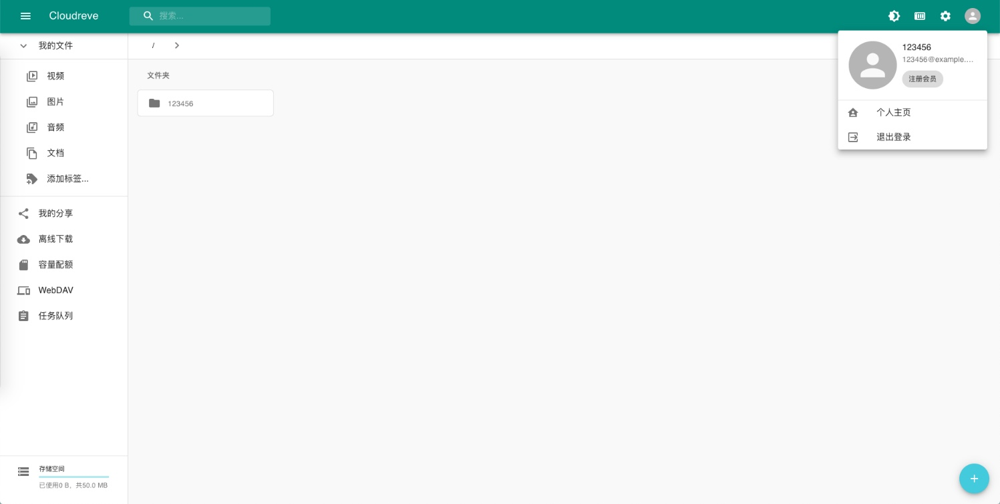
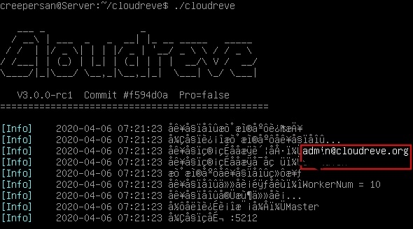
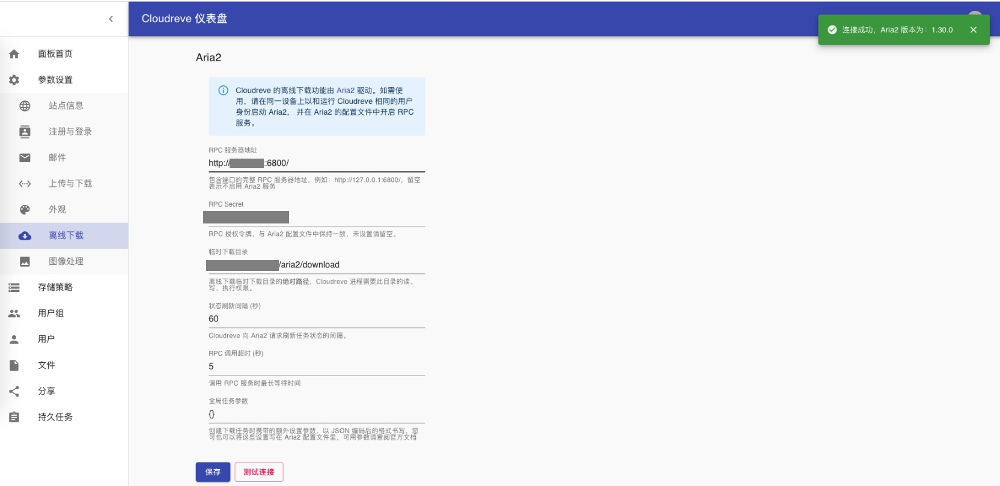

# 【应用分享】快速搭建支持离线下载的私人云盘

### 前言


之前就一直有在找一个支持离线下载的开源云盘，某天在知乎上看到推荐 [Cloudreve](https://cloudreve.org/)，支持离线下载、在线预览、文件分享以及多用户等功能，挺符合自己的需求的，因此尝试按照官网说明搭建了一个自己使用，这里进行下简单记录。官方提供的预览地址可以[看这里](https://demo.cloudreve.org/)



### 快速搭建网盘

到[这里](https://github.com/cloudreve/Cloudreve/releases)下载想要部署到版本

这里使用的是 3.0.0 - RC1

首先先下载程序包

```
wget https://github.com/cloudreve/Cloudreve/releases/download/3.0.0-rc1/cloudreve_3.0.0-rc1_linux_amd64.tar.gz
```

下载完成后解压程序包

```
tar -zxvf cloudreve_3.0.0-rc1_linux_amd64.tar.gz
```

赋予执行权限

```
chmod +x ./cloudreve
```

然后可以尝试启动看看，应用默认将会启动在5212端口上

```
./cloudreve
```

默认的管理员账号与密码将会在第一次运行时生成，红框中圈住的部分



### 添加离线下载支持

Cloudreve 支持 [Aria2](https://github.com/aria2/aria2) 离线下载，如果需要离线下载功能的话，还需要安装 Aria2 并在设置中添加相关配置信息

首先安装 Aria2

```
sudo apt-get install aria2
创建文件并配置
```

然后创建相关目录与配置文件

```
mkdir aria2
cd aria2
touch aria2.conf
touch aria2.log
touch session.dat
mkdir download
```

编辑配置文件，Aria2是非常强大的工具，其提供了很多的配置项，相关的详细说明可以在官网查阅，这里贴一下自己在使用的配置文件（网上找到的），各位可以参考

```
# Basic Options
dir=Aira目录/download
input-file=Aira目录/session.dat
log=Aira目录/aria2.log
max-concurrent-downloads=5
max-connection-per-server=5
check-integrity=true
continue=true

# BitTorrent/Metalink Options
bt-enable-lpd=true
bt-max-open-files=16
bt-max-peers=8
dht-file-path=/opt/var/aria2/dht.dat
dht-file-path6=/opt/var/aria2/dht6.dat
dht-listen-port=6801
#enable-dht6=true
listen-port=6801
max-overall-upload-limit=0K
seed-ratio=0

# RPC Options
enable-rpc=true
rpc-allow-origin-all=true
rpc-listen-all=true
rpc-listen-port=6800
rpc-secret=RPC授权令牌
rpc-secure=RPC是否开启授权令牌

# Advanced Options
daemon=true
disable-ipv6=true
#enable-mmap=true
force-save=true
file-allocation=none
log-level=warn
max-overall-download-limit=0K
save-session=Aira目录/session.dat
always-resume=true
split=10
min-split-size=10M

# Baidu Pan
user-agent=netdisk;5.2.6;PC;PC-Windows;6.2.9200;WindowsBaiduYunGuanJia
referer=http://pan.baidu.com/disk/home
```

启动 Aria2

```bash
sudo aria2c --conf-path=/etc/aria2/aria2.conf
```

如果没看到相关报错信息出错，则表示配置文件OK

接下来使用管理员登陆到管理面板配置测试下连接



填上之前配置的参数，点击测试连接，出现连接成功，则代表离线下载已经OK

### Nginx 反向代理配置

现在还是直接使用IP地址进行访问，我们可以配置通过域名进行访问，编辑Nginx配置文件，新增相关配置（网上找到的）

```nginx
upstream cloudreve{
	server 127.0.0.1:5212;
}

server {
	listen 80;
	server_name 域名;
	
	location / {
		proxy_set_header X-Real=IP $remote_addr;
		proxy_set_header X-Forwarded-For $proxy_add_x_forwarded_for;
		proxy_set_header Host $http_host;
		proxy_set_header X-Nginx_Proxy true;
		
		proxy_redirect off;
		proxy_pass http://cloudreve;
	}
	
	client_max_body_size 4096m; # 单个文件最大上传大小
}
```

至此，一个支持你可以享用你的专属云盘啦。当然你还可以增加Https等等，这些就待你继续折腾啦