# 【从零开始的iOS应用开发之旅 - 04】UITableView的简单使用

上面我们实现了简单的页面切换，接下来就是一个非常常用的控件——列表，UITableView

### 引入UITableView到界面中

由于目前我们在更多的页面上还是使用的默认的UIViewController，所以，我们先把它修改成UITableViewController。

> 当然你也可以不这样做，也可以直接通过 addView 的方法把 UITableView 添加到 原有的VC 中也能实现效果，下面只是记录了自己的做法

首先，先创建对应的文件

`BIMoreViewController.m`

```objective-c
#import "BIMoreViewController.h"

@interface BIMoreViewController ()

@end

@implementation BIMoreViewController

- (void)viewDidLoad {
    [super viewDidLoad];
}

@end
```

`BIMoreViewController.h`

```objective-c
#import <UIKit/UIKit.h>

NS_ASSUME_NONNULL_BEGIN

@interface BIMoreViewController : UITableViewController

@end

NS_ASSUME_NONNULL_END
```


> 这里说个事情，为什么这里的文件名不使用MoreViewController而是使用BIMoreViewController呢？这是因为在后面可能我们需要引入一些第三方框架，但是她不像Android开发中有包的概念，为了防止引入的第三方库使用了重复的名字导致编译错误的问题，所以一般使用自己的前缀以作区分以及防止重复命名的问题。


然后替换第三个页面为我们刚刚创建的VC，并且移除掉之前用于测试跳转的UIView，修改完成后就像下面这样子（主要是之前controller3变量那部分位置的代码的变化）

`SceneDelegate.m`

```objective-c
- (void)scene:(UIScene *)scene willConnectToSession:(UISceneSession *)session options:(UISceneConnectionOptions *)connectionOptions {
    
    self.window = [[UIWindow alloc] initWithWindowScene: (UIWindowScene *)scene];
    
    UITabBarController *tabBarController = [[UITabBarController alloc] init];

    ViewController *viewController = [[ViewController alloc] init];
    viewController.view.backgroundColor = [UIColor yellowColor];
    viewController.tabBarItem.title = @"图库";
    viewController.tabBarItem.image = [UIImage imageNamed:@"ic_gallery_nav_gray"];

    UIViewController *controller2 = [[UIViewController alloc] init];
    controller2.view.backgroundColor = [UIColor greenColor];
    controller2.tabBarItem.title = @"壁纸";
    controller2.tabBarItem.image = [UIImage imageNamed:@"ic_bing_nav_gray"];

    BIMoreViewController *moreViewController = [[BIMoreViewController alloc] init];
    // moreViewController.view.backgroundColor = [UIColor cyanColor];
    moreViewController.tabBarItem.title = @"更多";
    moreViewController.tabBarItem.image = [UIImage imageNamed:@"ic_more_nav_gray"];
    
    [tabBarController setViewControllers: @[viewController, controller2, moreViewController]];
    
    UINavigationController *rootViewController = [[UINavigationController alloc] initWithRootViewController:tabBarController];
    self.window.rootViewController = rootViewController;
    [self.window makeKeyAndVisible];
    
}
```

编译运行，我们可以看到这样的画面

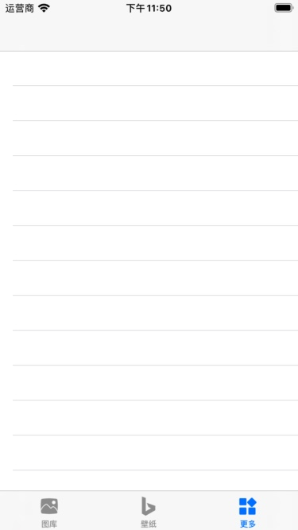


可以看到，UITableViewController已经替换了原本的UIViewController并且UITableViewController中的UITableView已经添加到里面，可以滚动并且也有了对应的分割线了，接下来要做的就是填充对应的数据。

### 实现UITableViewDataSource为列表添加数据

其实UITableView仅仅只是作为一个视图UI的展示，本身是不具有数据管理功能的。因此需要展示数据，还需要开发者提供对应的展示数据和cell，通过delegate的实际模式，实现UITableViewDataSource定义的方法来给UITableView设置对应的数据。

所以首先我们先让BIMoreViewController实现UITableViewDataSorce，修改类的 @interface 为（主要是添加了<>里面的代码）

`BIMoreViewController.m`

```
@interface BIMoreViewController () <UITableViewDataSource>

@end
```

接下来在 viewDidLoad 方法中设置 DataSource 为自身，代码如下

```objective-c
self.tableView.dataSource = self;
```


通过查看UITableViewDataSource的定义可以看到，要向UITableView提供相应的数据，最基础要实现这两个方法定义

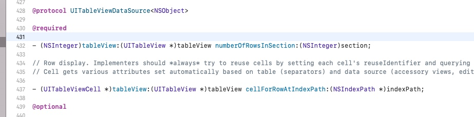

一个是 `numberOfRowsInSection` 来描述里面的数据量，另外一个是 `cellForRowAtIndexPath` 来描述里面的 cell 要怎么样展示内容。

第一个方法比较好理解，有多少数据返回多少。

第二个方法也好理解，其需要返回UITableViewCell，那么我们就返回UITableViewCell，系统已经提供了数种UITableViewCell的样式了，这里就直接使用默认的样式进行设置

在 `BIMoreViewController` 中加入两个方法

```objective-c
- (NSInteger)tableView:(UITableView *)tableView numberOfRowsInSection:(NSInteger)section {
    return 6;
}

- (UITableViewCell *)tableView:(UITableView *)tableView cellForRowAtIndexPath:(NSIndexPath *)indexPath {
    UITableViewCell *cell = [[UITableViewCell alloc] initWithStyle:UITableViewCellStyleDefault reuseIdentifier:@"id"];
    cell.textLabel.text = @"标题";
    return cell;
}
```

> 其中的参数 indexPath 中有2个成员变量，分别为 section 与 row 对应为分组下标与分组下的cell下标

编译运行，可以看到，已经能成功展示出对应的数据了

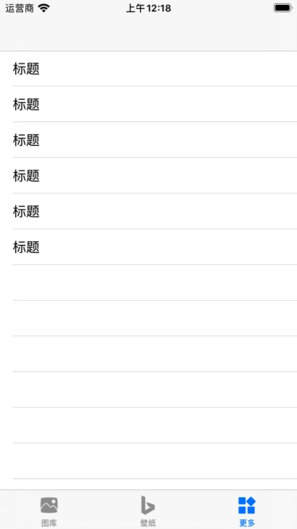

> 上面设置代码中，UITableViewCell的初始化使用的是 initWithStyle 方法，而其中的第一个参数就是UITableViewCell的样式，系统提供的样式大概如下
>
> 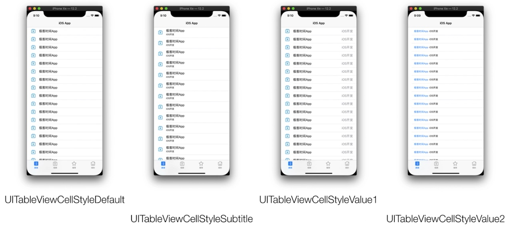

当我们观察仔细一点，可以发现设置列表展示内容 `cellForRowAtIndexPath` 中的序号 `indexPath` 并不只是简单的整形，而是NSIndexPath，观察里面的内容，可以发现有两个成员变量标识其下标，分别是 `row ` 和 `section`。

### 让UITableView支持分组展示

其实UITableView原生是支持分组的，上面的成员变量中`section`代表是哪一个组， `row`代表是组的第几个。 要设置有多少个组，可以实现UITableViewDataSource定义的这个方法

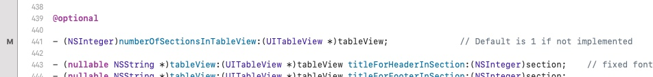

BIMoreViewController内添加以下代码

```objective-c
- (NSInteger)numberOfSectionsInTableView:(UITableView *)tableView {
    return 2;
}
```

编译运行，可以发现，数量翻了一倍

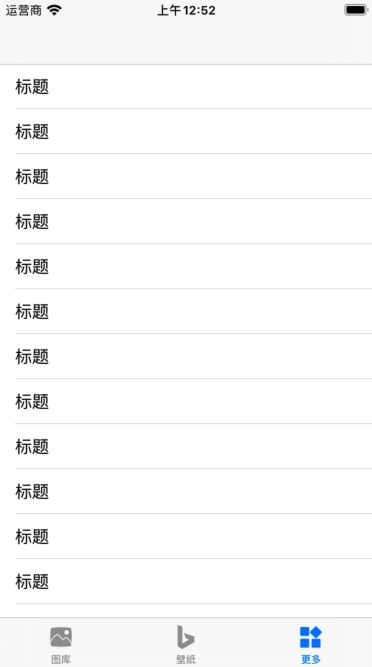

其实是里面有2个组，每个组都是原本定义的6个cell。于是看起来数量就翻了一倍。我们换一种style，就应该很明显了。找到BIMoreController实例化的代码，把原来的

```objective-c
BIMoreViewController *moreViewController = [[BIMoreViewController alloc] init];
```

修改为

```objective-c
BIMoreViewController *moreViewController = [[BIMoreViewController alloc] initWithStyle:UITableViewStyleGrouped];
```

编译运行

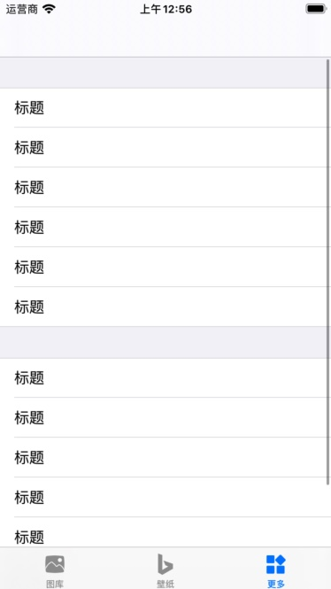

这样看起来就很清楚了。

### 添加Header与Footer

其实我们也可以给UITableView添加一个Header和Footer，比如像这样子添加一个Header

```objective-c
		UIImageView *headerView = [[UIImageView alloc] init];
    headerView.image = [UIImage imageNamed:@"ic_bing_nav_gray"];
    headerView.frame = CGRectMake(0, 0, self.view.bounds.size.width, 100);
    headerView.backgroundColor = [UIColor greenColor];
    self.tableView.tableHeaderView = headerView;
```

在BIMoreViewController的viewDidLoad添加上面的语句，编译运行，就能看到添加上去的绿色背景的图片Header

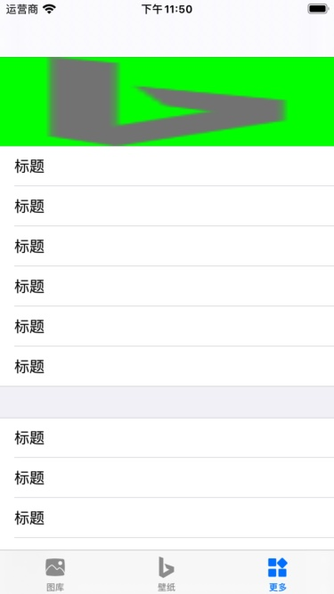

同样Footer也是类似，在后面添加上以下代码

```objective-c
    UILabel *footerView = [[UILabel alloc] initWithFrame:CGRectMake(0, 0, self.view.bounds.size.width, 36)];
    footerView.text = @"v 0.0.1";
    footerView.textAlignment = NSTextAlignmentCenter;
    self.tableView.tableFooterView = footerView;
```

编译运行，可以看到列表的底部多了一个居中的文本Footer

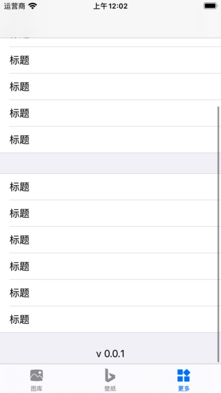

### 处理点击事件

就像其他的大部分的列表项一样，它不仅仅能展示相应的数据，也能接收相应点击事件的处理。

与UITableViewDataSource一样，同样也有接收列表控制事件的UITableViewDelegate，像实现UITableViewDataSource一样引入UITableViewDelegate

在 BIMoreViewController.m 的声明修改为

```objective-c
@interface BIMoreViewController () <UITableViewDataSource, UITableViewDelegate>

@end
```

同时在 viewDidLoad 中添加以下语句，设置自身为UITableView的Delegate

```objective-c
self.tableView.delegate = self;
```

实现点击事件的接收，可以看到 UITableViewDelegate 中有这样的方法定义

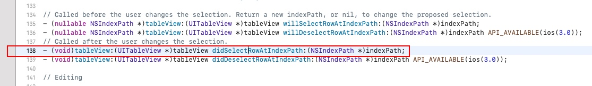

把对应方法实现添加到 BIMoreViewController.m 中

```objc
- (void)tableView:(UITableView *)tableView didSelectRowAtIndexPath:(NSIndexPath *)indexPath {
    [self.navigationController pushViewController:[[SettingViewController alloc] init] animated:YES]; // 跳转到设置界面
}
```

编译运行，可以看到，点击时界面也跳转到了之前的设置界面

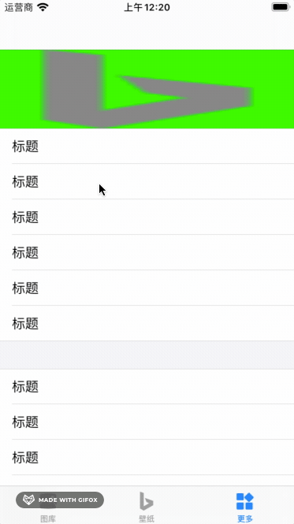

### 填充实际的数据

上面的代码均为简单的测试数据，下面我们可以填充实际展示的数据了，我们可以把所需要显示的数据放置于一个数组中，然后按照需要取值展示。当然实现方法非常多，下面代码可以给大家一个参考

`完整的BIMoreViewController.m`

```objc
#import "BIMoreViewController.h"
#import "SettingViewController.h"

static NSString * const CELL_SETTING = @"设置";
static NSString * const CELL_WEBSITE = @"访问网页版";
static NSString * const CELL_FEEDBACK = @"反馈";
static NSString * const CELL_HELP = @"帮助";
static NSString * const CELL_ABOUT = @"关于";

@interface BIMoreViewController () <UITableViewDataSource, UITableViewDelegate>

@property (nonatomic, strong) NSMutableArray <NSArray *> *tableList;

@end

@implementation BIMoreViewController

- (void)viewDidLoad {
    [super viewDidLoad];
    
    [self initDataList];
    
    self.tableView.dataSource = self;
    self.tableView.delegate = self;
    
    UIImageView *headerView = [[UIImageView alloc] init];
    headerView.image = [UIImage imageNamed:@"ic_bing_nav_gray"];
    headerView.frame = CGRectMake(0, 0, self.view.bounds.size.width, 100);
    headerView.backgroundColor = [UIColor greenColor];
    self.tableView.tableHeaderView = headerView;
    
    UILabel *footerView = [[UILabel alloc] initWithFrame:CGRectMake(0, 0, self.view.bounds.size.width, 36)];
    footerView.text = @"v 0.0.1";
    footerView.textAlignment = NSTextAlignmentCenter;
    self.tableView.tableFooterView = footerView;
}

- (void) initDataList {
    _tableList = [NSMutableArray arrayWithObject:@[CELL_SETTING]];
    [_tableList addObject:@[CELL_WEBSITE, CELL_FEEDBACK]];
    [_tableList addObject:@[CELL_HELP, CELL_ABOUT]];
}

- (NSInteger)tableView:(UITableView *)tableView numberOfRowsInSection:(NSInteger)section {
    return _tableList[section].count;
}

- (NSInteger)numberOfSectionsInTableView:(UITableView *)tableView {
    return _tableList.count;
}

- (UITableViewCell *)tableView:(UITableView *)tableView cellForRowAtIndexPath:(NSIndexPath *)indexPath {
    UITableViewCell *cell = [[UITableViewCell alloc] initWithStyle:UITableViewCellStyleDefault reuseIdentifier:@"id"];
    cell.textLabel.text = _tableList[indexPath.section][indexPath.row];
    return cell;
}

- (void)tableView:(UITableView *)tableView didSelectRowAtIndexPath:(NSIndexPath *)indexPath {
    NSString *name = _tableList[indexPath.section][indexPath.row];
    if ([name isEqualToString:CELL_SETTING]) { // 设置
        [self.navigationController pushViewController:[[SettingViewController alloc] init] animated:YES];
    } else if ([name isEqualToString:CELL_WEBSITE]) { // 访问网页版
           
    } else if ([name isEqualToString:CELL_FEEDBACK]) { // 反馈
          
    } else if ([name isEqualToString:CELL_HELP]) { // 帮助
             
    } else if ([name isEqualToString:CELL_ABOUT]) { // 关于
                
    }
    
}

@end

```

所展示的数据存储在 tableList 中，展示时从 tableList 中取数据即可进行展示

编译运行可以得到得到这样的列表

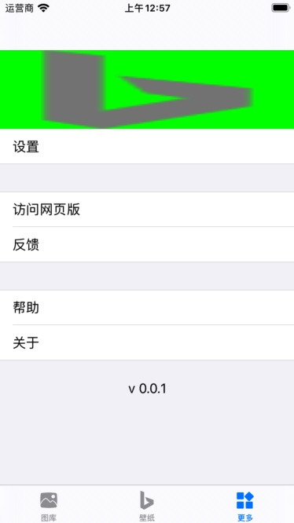