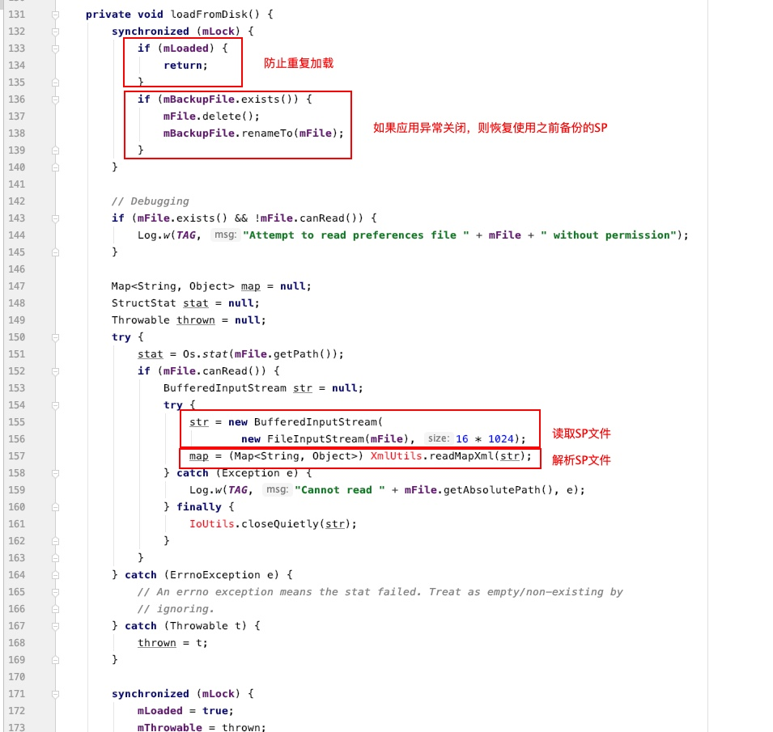
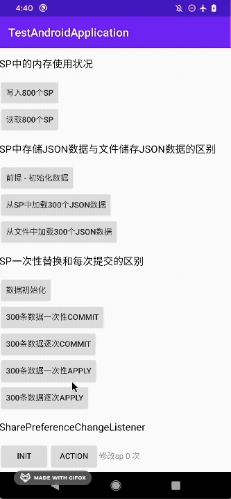

# 聊聊SharedPreferences的一些使用误区

### 什么是SharedPreferences

SharedPreferences（以下简称SP） 是 Android sdk 内提供的一套简单可靠、易用的保存键值对集合的解决方案。SP对象指向包含键值对的文件，均由SP框架管理，并对外提供了读写键值对的简单易用的读写方法，使得我们可以不用去考虑文件、内存管理等等实现细则，直接使用对外提供的方法来持久化键值对数据，使用起来简单可靠。

要获取SP对象也非常简单，只需要调用`Context.getSharedPreferences(String, int)`即可获取，对应的SP文件会默认生成在 /data/data/应用包名/shared_pref 路径下


SP文件内部是以XML格式保存的键值对信息，里面的内容就像这样子


而且SP默认所存放的路径不在用户存储的分区里面，其他应用以及用户自身是无法访问的，这样一来数据也相对安全（如果你root了系统或者解锁了设备就另说了）

虽然SP简单易用且强大，但是从Android的官方文档中也可以看到这样一行描述

> 如果您有想要保存的相对较小键值对集合，则应使用 `SharedPreferences` API。

这里强调了是使用保存相对较小的键值对集合，也就是说SP虽然很强大，但是也并不是适合在所有的情况下使用，也是存在着一定的局限性。自己写的一些小demo做了一些测试，对比其他方式实现方法也确实能佐证这一情形。

| 测试设备    | 红米Note7                                            |
| ----------- | ---------------------------------------------------- |
| CPU         | 高通骁龙660 AIE 8 core @ 2.2GHz                      |
| RAM         | 4GB LPDDR 4x                                         |
| ROM         | 64GB eMMC 5.1                                        |
| 系统        | PixelExperience_lavender-10.0-20200412-1101-OFFICIAL |
| Android版本 | 10                                                   |


### SP并不适用于存储复杂的数据

通常，SP会被我们用来保存一些应用的配置信息，以便记住使用户的一些操作习惯和偏好，给用户带来更好的使用体验。

但是当一些配置信息相对比较复杂或者从别的地方拿到的配置信息相对比较复杂（比如说像是 JSON 格式化的一些配置信息，一些 HTML 数据），使用SP来储存，并不见得是一个优雅的解决方案。比如像是下面的例子

假设有这样的JSON数据需要从SP中读取出来，测试读取300次


相关代码为

```kotlin
		// 测试从SP中读取
		fun onTest2LoadFormSPClick(v: View){
        val startTime = System.currentTimeMillis()
        for (i in 0 until 300){
            val sp = getSharedPreferences("SP_02_$i", Context.MODE_PRIVATE)
            sp.getString(i.toString(), TEST_2_JSON_DATA)
        }

        log("加载耗时 ${System.currentTimeMillis() - startTime}")
    }

		// 测试从文件中读取
    fun onTest2LoadFormFileClick(v: View){
        val startTime = System.currentTimeMillis()

        for (i in 0 until 300){
            val file = File("${Environment.getExternalStorageDirectory().absolutePath}/testSP/test2/${i}.json")
            if (!file.exists()){
                log("加载文件出错 文件#${i}不存在")
            }else{
                val bis = BufferedInputStream(FileInputStream(file), 16 * 1024)
                val map = HashMap<String, Any>()
                map[i.toString()] =  bis.reader().readText()
            }
        }

        log("加载耗时 ${System.currentTimeMillis() - startTime}")
    }
```

测试10次，得到的结果为

|      | 1    | 2    | 3    | 4    | 5    | 6    | 7    | 8    | 9    | 10   | Avg    |
| ---- | ---- | ---- | ---- | ---- | ---- | ---- | ---- | ---- | ---- | ---- | ------ |
| SP   | 1400 | 1232 | 956  | 1224 | 1108 | 1031 | 1188 | 947  | 1229 | 1279 | 1159.4 |
| File | 340  | 327  | 424  | 464  | 317  | 328  | 323  | 346  | 326  | 336  | 353.1  |

可见直接把JSON存储为文件要比存在SP要快上不止一点半点。

为什么呢？其实我们查看SP保存后的文件，就可以看到情况


可以看到储存在SP里面的JSON数据为了读取时能正确读取，特殊字符 `"` 都被转义成了 `&quot;` 这一部分的字符串截取拼接操作耗时确实不容忽视。

其实像是 JSON 这样的格式化的文本本身就可以当做配置文件，不必再次在 JSON 的外面加一层 XML 的格式化，这样不仅仅增加数据量且会有字符串拼接的操作出现。


### SharedPreferences所占用的内存不会释放

Talk is cheap，直接上测试代码，读取800个SP，每个SP里面有1000条数据，每条数据都是一个时间戳

```kotlin
		// 读取
		fun onRead800SPClick(v: View){
        for (i in 0 until 800){
            log("Reading SP#$i")
            val sp = getSharedPreferences("SP_01_$i", Context.MODE_PRIVATE)
            sp.getLong("0", 0)
        }
    }

		// SP的内容
    fun onLoad800SPClick(v: View){
        for (i in 0 until 800){
            log("Writing SP#$i")
            val sp = getSharedPreferences("SP_01_$i", Context.MODE_PRIVATE)
            val edit = sp.edit()
            for (j in 0 until 1000){
                edit.putLong(j.toString(), System.currentTimeMillis())
            }
            edit.apply()
        }
    }
```

这里观察应用内存的变化，使用的是Android自带的Profiler工具

在读取前，可以看到应用内存是这样的情况


读取800个SP后，应用占用内存暴涨变成了这样


这时，通过profiler工具手动触发gc，应用内存变化如下（出现波形抖动是因为连续触发了几次gc）


可见经过gc过后，应用内存确实有所下降。但是与一开始的内存占用想比，确实还有相当一部分内存无法释放

为什么呢？我们可以从源码中窥见SP的实现原理（API 29）

从获取SP对象开始，我们都是通过 Context.getSharedPreference(String, int) 这样的方式来进行SP对象的获取，具体的实现代码在 `ContextImpl.java` 中


SharePreferencesImpl是SP的实现类，跟踪进入 SharePreferencesImpl 的实例化中


可以看到SP的加载是开了一个子线程调用 loadFromDisk 方法加载，并且还有为了防止数据出现特殊情况恢复的备份文件，不过这里我们先不管这些。继续跟踪进入方法里面




这个mMap定义在这里


也就是说SP从文件中加载并解析XML后，会把解析到的结果存在一个名叫 mMap 的成员变量中


从读取数据的方法中也可以看到，也都是操作 mMap ，从这个成员变量中读取的。也就是说每一个SP都会占用对应所储存数据量的内存。可为什么这写内存在没有外部直接引用的情况下，gc也不会回收掉响应的内存呢？

我们可以回到 ContextImpl.java 获取 SP 对象的方法中


可以看到，这里也有一个cache。继续跟踪进入 getSharedPreferencesCacheLocked() 方法内


可以看到，这里还有一个缓存 —— sSharedPrefsCache。当我们每创建一个SP，都会放入到这个缓存中，下次我们再 getSharedPreferences 时，如果已经创建过了，则直接返回缓存里面的SP。

查看这个缓存的声明，可以看到


可以看到这个缓存是静态变量。并且查看这个变量的引用，并没有对应的 remove 和 clear 方法的调用

也就是说，我们每一个通过 getSharedPreferences 获取到的 SP ，都会被应用缓存起来，并且这个缓存是静态的，没有对应的清除缓存，那么**我们加载过的 SP 都不会被清理，一直存在于内存中，直至应用结束或被杀死**


### 一般数据可以使用apply代替commit

commit方法 与 apply方法 都是设置完数据后写入变更的。只不过 commit 与 apply 的使用范围也不一样。

`commit`


`apply`


可见，操作流程大致相同。不过可以看到双方在提交写文件的 runnable 时，所传的参数并不一样。commit 中第二个参数为 null，而 apply 则是对应的 runnable 。

跟踪进入 enqueDiskWrite 方法中


由此可以看到第二个参数的影响了

由于 commit 传递的是null，因此就直接在当前线程 run 了对应写文件的 runnable。

而 apply 传递的是对应的 runnable，因此是吧对应的 runnable 压入的队列中，由 `queued-work-looper` 这个 HandlerThread 来执行对应的写文件。

因此，commit其实是会阻塞所在线程的方法。如果在应用中不是特别重要的数据需要确保写入成功的，都可以使用 apply 来代替。因为 apply 并不会阻塞当前所在线程，带来更优异的使用体验，并且一般情况下都能正常写入成功，不必过于担心，替换起来也十分简单。

通过测试代码循环300次分别用 commit 和 apply 提交SP的修改，结果也能反映这个带来的性能巨大优化

```kotlin
   	// commit
   	fun onTest3CommitAtOnce(v: View){
        val timeStamp = System.currentTimeMillis()

        for (i in 0 until 30){
            val sp = getSharedPreferences("SP_03_TEST_$i", Context.MODE_PRIVATE)
            val edit = sp.edit()
            for (j in 0 until 10){
                edit.putLong(j.toString(), System.currentTimeMillis())
            }
            edit.commit()
        }

        log("耗时：${System.currentTimeMillis() - timeStamp}")
    }
    
    // apply
    fun onTest3ApplyAtOnce(v: View){
        val timeStamp = System.currentTimeMillis()
        for (i in 0 until 30){
            val sp = getSharedPreferences("SP_03_TEST_$i", Context.MODE_PRIVATE)
            val edit = sp.edit()
            for (j in 0 until 10){
                edit.putLong(j.toString(), System.currentTimeMillis())
            }
            edit.apply()
        }
        log("耗时：${System.currentTimeMillis() - timeStamp}")
    }
```

执行上面的代码，可以得到结果（已排除加载sp的时间）

|        | 1    | 2    | 3    | 4    | 5    | 6    | 7    | 8    | 9    | 10   | Avg   |
| ------ | ---- | ---- | ---- | ---- | ---- | ---- | ---- | ---- | ---- | ---- | ----- |
| commit | 247  | 257  | 244  | 236  | 238  | 234  | 223  | 227  | 228  | 229  | 236.3 |
| apply  | 3    | 2    | 1    | 2    | 2    | 1    | 1    | 2    | 1    | 1    | 1.6   |


### 多次修改尽量一次提交

这个也没什么好说的，应该大家都知道原因

测试代码如下

```kotlin
		// 一次性commit
    fun onTest3CommitAtOnce(v: View){
        val timeStamp = System.currentTimeMillis()

        for (i in 0 until 30){
            val sp = getSharedPreferences("SP_03_TEST_$i", Context.MODE_PRIVATE)
            val edit = sp.edit()
            for (j in 0 until 10){
                edit.putLong(j.toString(), System.currentTimeMillis())
            }
            edit.commit()
        }

        log("耗时：${System.currentTimeMillis() - timeStamp}")
    }

		// 一个一个commit
    fun onTest3CommitOneByOne(v: View){
        val timeStamp = System.currentTimeMillis()
        for (i in 0 until 30){
            val sp = getSharedPreferences("SP_03_TEST_$i", Context.MODE_PRIVATE)
            for (j in 0 until 10){
                sp.edit().putLong(j.toString(), System.currentTimeMillis()).commit()
            }
        }
        log("耗时：${System.currentTimeMillis() - timeStamp}")
    }

		// 一次性apply
    fun onTest3ApplyAtOnce(v: View){
        val timeStamp = System.currentTimeMillis()
        for (i in 0 until 30){
            val sp = getSharedPreferences("SP_03_TEST_$i", Context.MODE_PRIVATE)
            val edit = sp.edit()
            for (j in 0 until 10){
                edit.putLong(j.toString(), System.currentTimeMillis())
            }
            edit.apply()
        }
        log("耗时：${System.currentTimeMillis() - timeStamp}")
    }

		// 一个一个 apply
    fun onTest3ApplyOneByOne(v: View){
        val timeStamp = System.currentTimeMillis()
        for (i in 0 until 30){
            val sp = getSharedPreferences("SP_03_TEST_$i", Context.MODE_PRIVATE)
            for (j in 0 until 10){
                sp.edit().putLong(j.toString(), System.currentTimeMillis()).apply()
            }
        }
        log("耗时：${System.currentTimeMillis() - timeStamp}")
    }
```

测试结果如下（已排除读取sp的时间）

|              | 1    | 2    | 3    | 4    | 5    | 6    | 7    | 8    | 9    | 10   | Avg    |
| ------------ | ---- | ---- | ---- | ---- | ---- | ---- | ---- | ---- | ---- | ---- | ------ |
| 一次性commit | 248  | 209  | 230  | 231  | 218  | 243  | 231  | 217  | 256  | 239  | 233.2  |
| 逐个commit   | 2539 | 3028 | 3144 | 3280 | 3149 | 3046 | 2953 | 3151 | 3117 | 3115 | 3052.2 |
| 一次性apply  | 1    | 2    | 1    | 1    | 1    | 1    | 1    | 1    | 1    | 1    | 1.1    |
| 逐个apply    | 10   | 6    | 4    | 5    | 8    | 5    | 4    | 4    | 4    | 8    | 5.8    |


### 灵活运用SharedPreferencesChangeListener

这个倒不是一些误区，是SP框架里面一个挺方便的功能，只是可能有时候被忽略了

sp常常用于保存一些未读红点、选项配置等信息。当修改这一些SP发生变化的时候，还需要更新到对应的UI或者触发其他逻辑。sp框架已经为我们提供了类似的支持，不必我们手动去更新代码或者手动发送一些event。

代码如下

```kotlin
    fun onTest4Init(v: View){
        mTest4Count = 0
        val sp = getSharedPreferences("SP_04_TEST", Context.MODE_PRIVATE)
        sp.edit().putLong("timestamp", System.currentTimeMillis()).apply()
        sp.registerOnSharedPreferenceChangeListener(this)
    }

    fun onTest4ActionClick(v: View){
        getSharedPreferences("SP_04_TEST", Context.MODE_PRIVATE).edit().putLong("timestamp", System.currentTimeMillis()).apply()
    }

    var mTest4Count = 0
    override fun onSharedPreferenceChanged(sharedPreferences: SharedPreferences?, key: String?) {
        sharedPreferences ?: return
        key ?: return
        mainTest4Text.text = "修改sp ${++mTest4Count} 次，值:${getSharedPreferences("SP_04_TEST", Context.MODE_PRIVATE).getLong("timestamp", 0L)}"
    }

    override fun onDestroy() {
        super.onDestroy()
        getSharedPreferences("SP_04_TEST", Context.MODE_PRIVATE).unregisterOnSharedPreferenceChangeListener(this)
    }
```

运行可得，当sp发生改变时，文本的值也对应发生了变化



而且这个不仅仅还能在当前界面通知，还能在其他地方进行通知，就像下面这样子


### 小尾巴

对于储存KV数据，腾讯微信团队有开源一套自己的开源组件[MMKV](https://github.com/tencent/mmkv)，是基于 mmap 内存映射文件的移动端通用 key-value 组件（应用只管写数据到内存，从内存写数据到文件由操作系统完成），底层序列化/反序列化使用 protobuf 实现，性能高，稳定性强。可用于 iOS、Android、Windows、Mac 等多个平台上。从2015年中在iOS平台上使用，并且微信Android平台上也在组件开源半年后引入了此组件。

