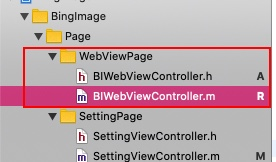
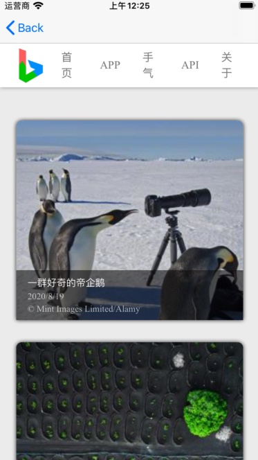
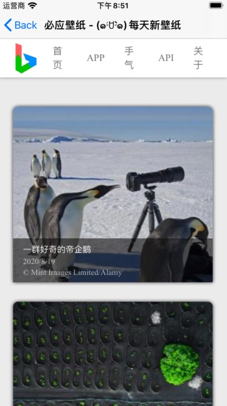
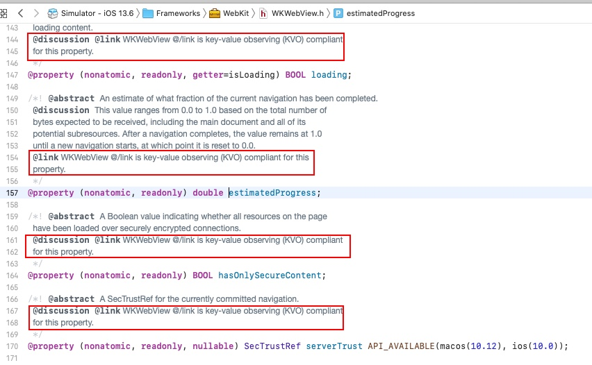

# 【从0开始的iOS应用开发之旅 - 06】WKWebView的简单使用

前面既然我们设置页面的设置选项能够进行跳转了，那么我们跟进到下一个选项，访问网页版

访问网页版的具体作用是在当前应用的新的页面中打开一个浏览器窗口，窗口中展示Bing壁纸的网页（也可以通过NavigationBar右侧的按钮使用外部浏览器打开）。

为了实现一个具有网页浏览功能的页面，我们可以借助WKWebView来实现对应的功能。

### 创建WKWebView并加载链接

首先我们可以先创建WKWebView对应的ViewController



由于WebView不像是其他如UIButton，UIImageView之类的View，WKWebVIew并不在UIKit里面，而是在WebKit中，因此如果需要使用到WKWebView，先得把WebKit的头文件加入进来

在 `BIWebViewController.m` 的顶部引入 WebKit

```objc
#import <WebKit/WebKit.h>
```

接下来，我们添加WKWebView的变量

在 @interface BIWebViewController 里面加入

```objc
@property(nonatomic, strong, readwrite) WKWebView *webView;
```

然后，我们在 viewDidLoad 方法中初始化 WKWebView 并添加到界面中，让其默认加载Bing壁纸的网址

```objc
    [self.view addSubview:({
        self.webView = [[WKWebView alloc] initWithFrame:CGRectMake(0, 88, self.view.bounds.size.width, self.view.bounds.size.height - 88)];
        self.webView;
    })];
    
    [self.webView loadRequest:[NSURLRequest requestWithURL:[NSURL URLWithString:@"https://bing.creepersan.com/"]]];
```

其中，代码中的数字 88 是指UINavigationBar这部分头部的高度

修改完成后，整个BIWebViewController将会是这个样子

```objc
#import "BIWebViewController.h"
#import <WebKit/WebKit.h>

@interface BIWebViewController ()

@property(nonatomic, strong, readwrite) WKWebView *webView;

@end

@implementation BIWebViewController

- (void)viewDidLoad {
    [super viewDidLoad];
    
    [self.view addSubview:({
        self.webView = [[WKWebView alloc] initWithFrame:CGRectMake(0, 88, self.view.bounds.size.width, self.view.bounds.size.height - 88)];
        self.webView;
    })];
    
    [self.webView loadRequest:[NSURLRequest requestWithURL:[NSURL URLWithString:@"https://bing.creepersan.com/"]]];
    
}

@end
```

最后，我们在对应的点击事件中加入跳转到WKWebView的逻辑

```objc
[self.navigationController pushViewController:[[BIWebViewController alloc] init] animated:YES];
```

编译运行，点击 我 标签下的 访问网页版 选项，可得到下面的结果



可见网页已经正常加载出来了

### 设置网页标题为页面标题

只需要通过一个 loadRequest 方法就能将网页展示出来。如果我们需要实现更多的功能我们可以给WebView设置delegate来获取WebView不同事件下的监听。

```objc
self.webView.navigationDelegate = self;
```

同时，也让VC实现WKNavigationController

```objc
@interface BIWebViewController () <WKNavigationDelegate>

@property(nonatomic, strong, readwrite) WKWebView *webView;

@end
```

delegate中有许多有用的方法，如`decidePolicyForNavigationAction`来决定链接是否去加载、`didFinishNavigation`来决定链接是否去跳转等等等等

这里我想让页面在加载完成后，展示对应的标题。我们可以这样实现

```objc
- (void)webView:(WKWebView *)webView didFinishNavigation:(null_unspecified WKNavigation *)navigation {
    self.navigationItem.title = webView.title;
}
```

运行可得结果



可得，页面标题也在页面加载完成后变成了网页的标题

### 通过KVO获取页面加载进度

这里我打算再增加一个进度条展示网页的加载进度，可以这样去实现。

其实，WebView在加载网页的时候，会向外以KVO（观察者设置模式）的方式通知页面加载的进度，我们可以从这里下手，获取对应的值并设置到界面的进度条中

首先，往界面上添加进度条（如果看不到进度条，可能是被标题栏挡住了，注意一下高度）

```objc
    [self.view addSubview:({
        self.progressView = [[UIProgressView alloc] initWithFrame:CGRectMake(0, 64, self.view.bounds.size.width, 46)];
        self.progressView;
    })];
```

然后添加对KVO的订阅

```objc
[self.webView addObserver:self forKeyPath:@"estimatedProgress" options:NSKeyValueObservingOptionNew context:nil];
```

有了订阅的同时也需要有取消订阅，可以再西沟函数中进行取消订阅

```objc
- (void)dealloc {
    [self.webView removeObserver:self forKeyPath:@"estimatedProgress"];
}
```

最后，实现对订阅事件响应的处理，实现对应 observeValueForKeyPath 方法

```objc
- (void)observeValueForKeyPath:(nullable NSString *)keyPath ofObject:(nullable id)object change:(nullable NSDictionary<NSKeyValueChangeKey, id> *)change context:(nullable void *)context {
    self.progressView.progress = self.webView.estimatedProgress;
    self.progressView.hidden = self.progressView.progress >= 1;
}
```

运行代码，可以看到。界面在加载过程中出现了进度条，并且在接在完成后进度条一并消失


可能过程中会有疑问了，是从哪里知道订阅的的名称呢？其实可以从源码的注释中找到，我们跳转到 webView 的源码中，可以看到



源码中已经有对应的注释了，拥有这些注释意味着对应的变化会通过KVO通知到订阅者

### 使用safari打开网页

最后我还想在右侧增加一个按钮，支持点击后使用外部浏览器（Safari）打开，可以这样实现

首先先添加对应的点击处理方法

```objc
- (void)onOpenWithBrowserClick {
    [[UIApplication sharedApplication] openURL:[NSURL URLWithString:@"https://bing.creepersan.com"] options:@{} completionHandler:nil];
}
```

然后添加对应的导航栏按钮

```objc
self.navigationItem.rightBarButtonItem = [[UIBarButtonItem alloc] initWithTitle:@"Safari打开" style:UIBarButtonItemStylePlain target:self action:@selector(onOpenWithBrowserClick)];
```

编译运行，可以看到标题栏右侧多了 `safari打开` 的选项，点击后将跳转外部浏览器打开[https://bing.creepersan.com](https://bing.creepersan.com)这个页面


