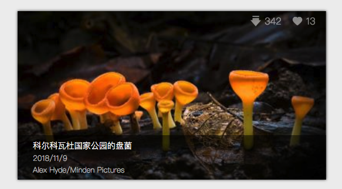
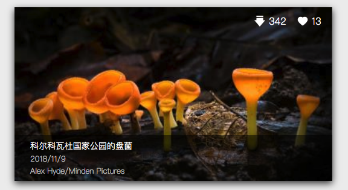

# 【CSS】使用伪类来实现鼠标划过动画效果和选中修改文本颜色

### 前言

嘛，这里也只是记录一下当时的实现方法，不会涉及到其他教学哦，需要详细了解的还得自行去搜搜相关教学哦

### 鼠标滑过动画效果

1. 首先先定义普通情况下的CSS啦

   ```CSS
   .img-card{
       width:30%;
       height:18em;
       min-width:20.5em;
       display:flex;
       flex-wrap:wrap;
       align-self:center;
       flex-direction:column;
       align-items:flex-end;
       margin:1em 1%;
       justify-content: space-between;
       box-shadow: 0 0 6px #333;
       cursor: pointer;
       transition: 0.3s;
   }
   ```

2. 然后就是准备下鼠标悬浮时候的CSS咯

   ```CSS
   .img-card:hover{
       width:30%;
       height:18em;
       min-width:20.5em;
       display:flex;
       flex-wrap:wrap;
       align-self:center;
       flex-direction:column;
       align-items:flex-end;
       margin:1em 1%;
       justify-content: space-between;
       box-shadow: 0 4px 18px #333;
       cursor: pointer;
       transition: 0.3s;
   }
   ```

3. 接下来我们就可以通过伪类来区分他们啦

   给悬浮时的CSS添加上这个

   ```CSS
   .img-card:hover{
   	...
   }
   ```

4. 加上时间就有动画效果啦

   ```CSS
   .img-card{
       ...
       transition: 0.3s;
   }
   
   .img-card:hover{
       ...
       transition: 0.3s;
   }
   ```

看起来就像这样，这是默认情况下的样子



这个是鼠标悬浮于上面的样子



哈哈，看不太出来，其实只是后面的阴影变大了而已啦


这里插一句，我们可以看到上图中右上角的数字也同时发生了变化，但是这上面的数字透明度的变化并不是定义在上面的哦，虽然说这也是通过伪类来实现的，他的透明度变化并不是把鼠标悬浮在这个右上角的图标之上才会变化的，而是和上面的一样，悬浮在卡片之上就直接进行动画的变化，其实他的实现也很简单，就像下面所看到的

```CSS
.img-card:hover .img-card-statistic-div {
    display: flex;
    flex-direction: row;
    justify-content: center;
    align-items: center;
    color: white;
    margin: 12px 6px;
    opacity: 1;
    transition: 0.3s;
}
```

其实也只是在伪类后面再加上一个类选择器而已~相似的，我们也可以使用 `#` 这个符号来指定 `id` 的变化哦~还可以一级一级的选择下去，配合这些就能实现一些非常炫酷的动画效果


### 修改文本选中颜色

1. 和上面的流程差不多，也是通过伪类来实现

   这里就不多说啦，直接上代码

   ```CSS
   *::selection {
       background: #03CC01;
       color: white;
   }
   ```

   这个是设置前的样子

   

   这个是设置后的样子

   
